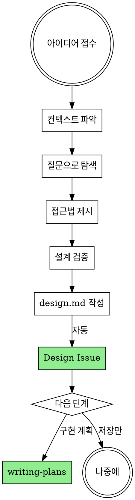

# Brainstorming Ideas Into Designs

## Overview

아이디어를 대화를 통해 구체적인 설계와 명세로 발전시킵니다.

프로젝트 컨텍스트를 파악한 후, 한 번에 하나씩 질문하여 아이디어를 정제합니다.

**Announce at start:** "brainstorming 스킬을 사용하여 설계를 진행합니다."

## The Process



**1. 아이디어 이해:**
- 프로젝트 상태 파악 (파일, 문서, 최근 커밋)
- 한 번에 하나씩 질문하여 아이디어 정제
- 가능하면 객관식 질문 선호
- 메시지당 질문 하나
- 목적, 제약조건, 성공 기준 파악에 집중

**2. 접근법 탐색:**
- 2-3가지 접근법과 트레이드오프 제시
- 추천 옵션과 이유를 먼저 설명

**3. 설계 제시:**
- 200-300단어 섹션으로 분할
- 각 섹션 후 확인 질문
- 다룰 내용: 아키텍처, 컴포넌트, 데이터 흐름, 에러 처리, 테스트

## After the Design

**1. 문서화:**
- `docs/plans/YYYY-MM-DD-<topic>-design.md`에 설계 저장
- git commit

**2. Milestone 확인:**

```bash
MILESTONE_TITLE=$(jq -r '.milestones.current' .github/github-superpowers.json)
```

**Milestone이 null인 경우 사용자에게 질문:**
```
이 설계를 어느 Milestone에 연결할까요?

1. [기존 Milestone 목록 조회: gh api repos/{owner}/{repo}/milestones]
2. 새 Milestone 생성
3. Milestone 없이 진행
```

**3. Design Issue 생성 (자동):**

```bash
# 설정 파일에서 값 읽기
PROJECT_OWNER=$(jq -r '.project.owner' .github/github-superpowers.json)
PROJECT_NUMBER=$(jq -r '.project.number' .github/github-superpowers.json)

# Design Issue 생성
DESIGN_URL=$(gh issue create \
  --title "design: <feature-name>" \
  --body-file docs/plans/YYYY-MM-DD-<topic>-design.md \
  --label "design" \
  --milestone "$MILESTONE_TITLE")  # 선택된 Milestone (없으면 생략)

# Project Roadmap에 추가
gh project item-add $PROJECT_NUMBER \
  --owner $PROJECT_OWNER \
  --url "$DESIGN_URL"

# Issue 번호 추출
DESIGN_NUMBER=$(echo "$DESIGN_URL" | grep -oE '[0-9]+$')

# design.md 헤더에 Issue 링크 추가
sed -i '1a\
**GitHub Issue:** #'"$DESIGN_NUMBER"' ('"$DESIGN_URL"')' docs/plans/YYYY-MM-DD-<topic>-design.md

# 변경사항 커밋
git add docs/plans/YYYY-MM-DD-<topic>-design.md
git commit -m "docs: link design issue #$DESIGN_NUMBER"
```

- design.md 내용을 Issue로 게시
- Milestone에 연결 (릴리스 계획)
- Project Roadmap에 추가 (진행 상태 추적)
- **design.md 헤더에 Issue 번호/URL 자동 추가**

**3. 다음 단계 (사용자에게 질문):**

```
다음 단계는?

1. 구현 계획 - 상세 Task 분해 및 GitHub 이슈 생성
2. 나중에 - 오늘은 여기까지
```

**구현 계획 선택 시:**
- **REQUIRED:** Use writing-plans 스킬
- design.md + Design Issue 기반으로 상세 구현 계획 작성
- impl.md 완성 후 자동으로 Epic 생성 (Design Issue 참조)

## Key Principles

- **한 번에 질문 하나** - 여러 질문으로 압도하지 않기
- **객관식 선호** - 가능하면 답하기 쉬운 형태로
- **YAGNI 철저히** - 불필요한 기능 설계에서 제거
- **대안 탐색** - 결정 전 2-3가지 접근법 제시
- **점진적 검증** - 설계를 섹션별로 제시하고 각각 검증

## 관련 스킬

- **writing-plans**: design.md → impl.md → GitHub 이슈
- **test-driven-development**: TDD 구현
