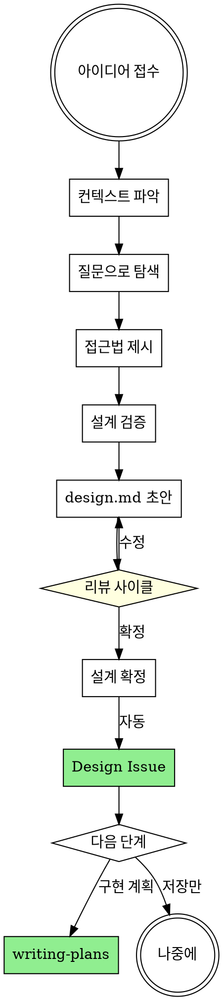

# Brainstorming Ideas Into Designs

## Overview

아이디어를 대화를 통해 구체적인 설계와 명세로 발전시킵니다.

프로젝트 컨텍스트를 파악한 후, 한 번에 하나씩 질문하여 아이디어를 정제합니다.

**Announce at start:** "brainstorming 스킬을 사용하여 설계를 진행합니다."

## The Process



**0. Serena 메모리 로드 (Optional):**

Serena MCP가 활성화된 프로젝트라면, 컨텍스트 탐색 전에 축적된 프로젝트 지식을 먼저 로드합니다.
새 세션에서 코드베이스를 처음부터 다시 탐색하는 비용을 줄여줍니다.

```
# 1. 사용 가능한 메모리 확인
list_memories

# 2. 이름 기반으로 관련 메모리 선택 로드 (우선순위순)
read_memory("project_overview")              # 프로젝트 목적, 기술 스택, 전체 구조
read_memory("architecture_and_conventions")  # 아키텍처 패턴, 코딩 컨벤션
read_memory("design_decisions_*")            # 최근 설계 결정사항 (있으면)
```

**메모리가 충분한 경우:** Step 1-1에서 전체 탐색 대신 변경된 부분만 확인하면 됩니다.
**메모리가 없거나 Serena 미사용:** 이 단계를 건너뛰고 Step 1-1로 진행합니다.

---

**1. 아이디어 이해:**

**1-1. 컨텍스트 탐색 방법 선택 (AskUserQuestion):**

```
AskUserQuestion:
"프로젝트 컨텍스트 파악을 어떻게 할까요?"

옵션:
1. Explore 서브에이전트 (Recommended) - 빠른 탐색
   - 추천: 파일 구조, README, 설정 파일 등 빠르게 훑기
   - 마스터 컨텍스트 절약, 병렬 탐색 가능
   - 비추천 상황: 복잡한 코드 구조/참조 관계 파악이 필요한 경우
2. Serena MCP (마스터 에이전트) - 정밀 분석
   - 추천: 클래스 계층, 메서드 참조, 심볼릭 분석이 필요한 경우
   - 코드 구조를 정확하게 파악 가능
   - 비추천 상황: 마스터 컨텍스트를 많이 소비함
3. 둘 다 사용 - 최대 정보 수집
   - 추천: 대규모 프로젝트에서 빠른 개요 + 핵심부 정밀 분석 조합
   - Explore로 전체 구조 파악 후, Serena로 핵심 심볼 분석
   - 비추천 상황: 간단한 프로젝트에는 과함
```

**Explore 서브에이전트 선택 시:**
- Task tool (subagent_type=Explore)로 프로젝트 구조, README, 설정 파일 탐색
- 결과를 마스터 에이전트가 요약 수신

**Serena MCP 선택 시:**
- `get_symbols_overview`, `find_symbol`, `search_for_pattern` 등 활용
- 마스터 에이전트가 직접 심볼릭 분석 수행

**둘 다 선택 시:**
- Explore 서브에이전트로 전체 구조/파일 목록 파악 (병렬)
- 핵심 파일/심볼은 Serena MCP로 정밀 분석

**1-2. 아이디어 정제:**
- 한 번에 하나씩 질문하여 아이디어 정제
- 가능하면 객관식 질문 선호
- 메시지당 질문 하나
- 목적, 제약조건, 성공 기준 파악에 집중

**2. 접근법 탐색:**
- 2-3가지 접근법과 트레이드오프 제시
- 추천 옵션과 이유를 먼저 설명

**3. 설계 제시:**
- 200-300단어 섹션으로 분할
- 각 섹션 후 확인 질문
- 다룰 내용: 아키텍처, 컴포넌트, 데이터 흐름, 에러 처리, 테스트

## After the Design

**1. 문서화 (초안):**
- `.claude/github-superpowers/plans/YYYY-MM-DD-<topic>-design.md`에 설계 저장
- git commit (하지 않음 - .gitignore됨)

**2. 리뷰 사이클 (AskUserQuestion):**

```
AskUserQuestion:
"design.md 초안이 완성되었습니다.
- 저장: .claude/github-superpowers/plans/YYYY-MM-DD-<topic>-design.md

리뷰해주세요. 다음 중 선택:"

옵션:
1. 수정 필요 - 피드백 주시면 반영합니다
2. 설계 확정 - Design Issue 생성으로 진행
3. 처음부터 다시 - 접근 방식 재검토
```

**수정 필요 선택 시:**
- 사용자 피드백 수렴
- design.md 수정
- git commit으로 변경사항 저장
- 다시 리뷰 사이클로 돌아감 (반복)

**설계 확정 선택 시:**
- Milestone 확인 → Design Issue 생성 진행

**3. Milestone 확인:**

```bash
MILESTONE_TITLE=$(jq -r '.milestones.current' .github/github-superpowers.json)
```

**Milestone이 null인 경우 사용자에게 질문:**
```
이 설계를 어느 Milestone에 연결할까요?

1. [기존 Milestone 목록 조회: gh api repos/{owner}/{repo}/milestones]
2. 새 Milestone 생성
3. Milestone 없이 진행
```

**3. Design Issue 생성 (자동):**

```bash
# 설정 파일에서 값 읽기
PROJECT_OWNER=$(jq -r '.project.owner' .github/github-superpowers.json)
PROJECT_NUMBER=$(jq -r '.project.number' .github/github-superpowers.json)

# design.md 내용 읽기
DESIGN_BODY=$(cat .claude/github-superpowers/plans/YYYY-MM-DD-<topic>-design.md)

# Design Issue 생성
DESIGN_URL=$(gh issue create \
  --title "design: <feature-name>" \
  --body "$DESIGN_BODY" \
  --label "design" \
  --milestone "$MILESTONE_TITLE")  # 선택된 Milestone (없으면 생략)

# 설정 파일에서 Project 정보 읽기 (init 안했으면 에러)
if [ ! -f .github/github-superpowers.json ]; then
  echo "Error: .github/github-superpowers.json not found. Run /init-github-superpowers first."
  exit 1
fi

PROJECT_ID=$(jq -r '.project.id' .github/github-superpowers.json)
START_DATE_FIELD=$(jq -r '.project.fields.startDate.id' .github/github-superpowers.json)
END_DATE_FIELD=$(jq -r '.project.fields.endDate.id' .github/github-superpowers.json)
ISSUE_TYPE_FIELD=$(jq -r '.project.fields.issueType.id' .github/github-superpowers.json)
DESIGN_TYPE_OPTION=$(jq -r '.project.fields.issueType.options.design' .github/github-superpowers.json)

# Project에 추가
ITEM_ID=$(gh project item-add $PROJECT_NUMBER \
  --owner $PROJECT_OWNER \
  --url "$DESIGN_URL" \
  --format json | jq -r '.id')

# Start Date 설정 (오늘)
gh project item-edit --project-id $PROJECT_ID --id $ITEM_ID \
  --field-id $START_DATE_FIELD --date "$(date +%Y-%m-%d)"

# End Date 설정 (Milestone due date 사용, 없으면 오늘+14일)
if [ -n "$MILESTONE_TITLE" ] && [ "$MILESTONE_TITLE" != "null" ]; then
  MILESTONE_DUE=$(gh api repos/{owner}/{repo}/milestones \
    --jq ".[] | select(.title==\"$MILESTONE_TITLE\") | .due_on" | cut -d'T' -f1)
fi
END_DATE=${MILESTONE_DUE:-$(date -d "+14 days" +%Y-%m-%d 2>/dev/null || date -v+14d +%Y-%m-%d)}
gh project item-edit --project-id $PROJECT_ID --id $ITEM_ID \
  --field-id $END_DATE_FIELD --date "$END_DATE"

# Issue Type 설정 (design)
gh project item-edit --project-id $PROJECT_ID --id $ITEM_ID \
  --field-id $ISSUE_TYPE_FIELD --single-select-option-id $DESIGN_TYPE_OPTION

# Issue 번호 추출
DESIGN_NUMBER=$(echo "$DESIGN_URL" | grep -oE '[0-9]+$')

# design.md 헤더에 Issue 링크 추가
sed -i '1a\
**GitHub Issue:** #'"$DESIGN_NUMBER"' ('"$DESIGN_URL"')' .claude/github-superpowers/plans/YYYY-MM-DD-<topic>-design.md

# 변경사항은 git ignore됨 - 커밋 불필요
```

- design.md 내용을 Issue로 게시
- Milestone에 연결 (릴리스 계획)
- Project Roadmap에 추가 (진행 상태 추적)
- **design.md 헤더에 Issue 번호/URL 자동 추가**

**3. 다음 단계 (사용자에게 질문):**

```
다음 단계는?

1. 구현 계획 - 상세 Task 분해 및 GitHub 이슈 생성
2. 나중에 - 오늘은 여기까지
```

**구현 계획 선택 시:**
- **REQUIRED:** Use writing-plans 스킬
- design.md + Design Issue 기반으로 상세 구현 계획 작성
- impl.md 완성 후 자동으로 Epic 생성 (Design Issue 참조)

## Key Principles

- **한 번에 질문 하나** - 여러 질문으로 압도하지 않기
- **객관식 선호** - 가능하면 답하기 쉬운 형태로
- **YAGNI 철저히** - 불필요한 기능 설계에서 제거
- **대안 탐색** - 결정 전 2-3가지 접근법 제시
- **점진적 검증** - 설계를 섹션별로 제시하고 각각 검증

## AskUserQuestion 가이드

질문할 때 **추천 항목과 이유**를 함께 제시:

```
AskUserQuestion:
"어떤 상태 관리를 사용할까요?"

옵션:
1. Zustand (Recommended)
   - 추천: 보일러플레이트 최소, FSD와 잘 맞음, 번들 크기 작음
   - 비추천 상황: 복잡한 비동기 로직이 많은 경우
2. Redux Toolkit
   - 추천: 대규모 팀, 복잡한 상태 로직, 강력한 DevTools
   - 비추천 상황: 간단한 앱에는 과함
3. React Query만
   - 추천: 서버 상태가 대부분인 경우
   - 비추천 상황: 클라이언트 전용 상태가 많은 경우
```

**필수 포함 사항:**
- 추천 항목 표시 (`Recommended`)
- 각 옵션의 **추천 이유**
- 각 옵션의 **비추천 상황/단점**

## 완료 후 (AskUserQuestion)

design.md 저장 + Design Issue 생성 후:

```
AskUserQuestion:
"설계가 완료되었습니다.
- 저장: .claude/github-superpowers/plans/YYYY-MM-DD-<topic>-design.md
- GitHub Issue: #N

다음 단계는?"

옵션:
1. 구현 계획 세우기 (Recommended) - 복잡한 작업
2. 바로 구현 - Design Issue 기반, Epic 없이 (간단한 작업)
3. 다른 아이디어 브레인스톰 - 새로운 설계 시작
4. 오늘은 여기까지
```

**바로 구현 선택 시:**

impl.md, Epic 생성 생략하고 바로 구현. 실행 방식 선택:

```
AskUserQuestion:
"구현 방식을 선택해주세요:"

옵션:
1. Agent Teams 사용 (Recommended) - 자동화된 빠른 구현
   - 현재 브랜치에서 작업 (main/master이면 새 브랜치 생성)
   - 서브에이전트가 자동으로 구현 및 테스트
   - worktree 사용 불가
2. 수동 구현 (워크트리 격리) - 단계별 직접 제어
   - worktree로 격리된 브랜치에서 작업
   - TDD 사이클을 직접 실행
   - 서브에이전트 사용 불가
```

**Agent Teams 선택 시:**
- 현재 브랜치 확인 (main/master이면 새 브랜치 생성)
- 서브에이전트에게 Design Issue 내용 전달
- **REQUIRED:** Use test-driven-development 스킬 (서브에이전트가)
- 커밋에 `Refs #[design-issue-number]` 포함
- PR에서 `Closes #[design-issue-number]`

**수동 구현 선택 시:**
- **REQUIRED:** Use using-git-worktrees 스킬
- **REQUIRED:** Use test-driven-development 스킬
- 커밋에 `Refs #[design-issue-number]` 포함
- PR에서 `Closes #[design-issue-number]`

## 관련 스킬

- **writing-plans**: design.md → impl.md → Epic (복잡한 작업)
- **using-git-worktrees**: 격리된 작업 공간
- **test-driven-development**: TDD 구현
