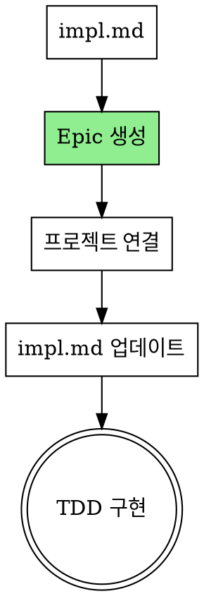

# GitHub Epic 생성

`writing-plans` 스킬에서 생성된 impl.md 파일을 기반으로 Epic 이슈를 생성합니다.

**Announce at start:** "creating-issues 스킬을 사용하여 Epic 이슈를 생성합니다."

## Plan → Epic 변환

- Design Issue → Epic에서 `Closes #N`으로 참조
- Goal/Architecture → Epic 설명
- 각 Task → 체크리스트 항목 (`- [ ] Task`)

## 워크플로우



## Epic 생성

```bash
# 설정 파일에서 값 읽기
PROJECT_OWNER=$(jq -r '.project.owner' .github/github-superpowers.json)
PROJECT_NUMBER=$(jq -r '.project.number' .github/github-superpowers.json)
MILESTONE_TITLE=$(jq -r '.milestones.current' .github/github-superpowers.json)

# impl.md 내용 읽기
IMPL_CONTENT=$(cat .claude/github-superpowers/plans/YYYY-MM-DD-<feature-name>-impl.md)

# Epic body 생성 (impl.md 내용 + 체크리스트)
EPIC_BODY="## 설계 문서
Closes #[design-issue-number]

## 구현 계획

${IMPL_CONTENT}

## Tasks
- [ ] Task 1: [설명]
- [ ] Task 2: [설명]
- [ ] Task 3: [설명]
"

EPIC_URL=$(gh issue create \
  --title "epic: <feature-name>" \
  --body "$EPIC_BODY" \
  --label "epic,feat" \
  --milestone "$MILESTONE_TITLE")

# 설정 파일에서 Project 정보 읽기 (init 안했으면 에러)
if [ ! -f .github/github-superpowers.json ]; then
  echo "Error: .github/github-superpowers.json not found. Run /init-github-superpowers first."
  exit 1
fi

PROJECT_ID=$(jq -r '.project.id' .github/github-superpowers.json)
START_DATE_FIELD=$(jq -r '.project.fields.startDate.id' .github/github-superpowers.json)
END_DATE_FIELD=$(jq -r '.project.fields.endDate.id' .github/github-superpowers.json)
PRIORITY_FIELD=$(jq -r '.project.fields.priority.id' .github/github-superpowers.json)
MEDIUM_OPTION_ID=$(jq -r '.project.fields.priority.options.medium' .github/github-superpowers.json)
ISSUE_TYPE_FIELD=$(jq -r '.project.fields.issueType.id' .github/github-superpowers.json)
FEAT_TYPE_OPTION=$(jq -r '.project.fields.issueType.options.feat' .github/github-superpowers.json)

# Project에 추가
ITEM_ID=$(gh project item-add $PROJECT_NUMBER \
  --owner $PROJECT_OWNER \
  --url "$EPIC_URL" \
  --format json | jq -r '.id')

# Start Date 설정 (오늘)
gh project item-edit --project-id $PROJECT_ID --id $ITEM_ID \
  --field-id $START_DATE_FIELD --date "$(date +%Y-%m-%d)"

# End Date 설정 (Milestone due date 사용, 없으면 오늘+14일)
if [ -n "$MILESTONE_TITLE" ] && [ "$MILESTONE_TITLE" != "null" ]; then
  MILESTONE_DUE=$(gh api repos/{owner}/{repo}/milestones \
    --jq ".[] | select(.title==\"$MILESTONE_TITLE\") | .due_on" | cut -d'T' -f1)
fi
END_DATE=${MILESTONE_DUE:-$(date -d "+14 days" +%Y-%m-%d 2>/dev/null || date -v+14d +%Y-%m-%d)}
gh project item-edit --project-id $PROJECT_ID --id $ITEM_ID \
  --field-id $END_DATE_FIELD --date "$END_DATE"

# Priority 설정 (Medium 기본값)
gh project item-edit --project-id $PROJECT_ID --id $ITEM_ID \
  --field-id $PRIORITY_FIELD --single-select-option-id $MEDIUM_OPTION_ID

# Issue Type 설정 (feat)
gh project item-edit --project-id $PROJECT_ID --id $ITEM_ID \
  --field-id $ISSUE_TYPE_FIELD --single-select-option-id $FEAT_TYPE_OPTION
```

## impl.md 업데이트

Epic 생성 후 impl.md 헤더에 Epic 번호/URL 자동 추가:

```bash
# Epic 번호 추출
EPIC_NUMBER=$(echo "$EPIC_URL" | grep -oE '[0-9]+$')

# impl.md 헤더에 Epic 링크 추가 (헤더 다음 줄에)
sed -i '1a\
**GitHub Epic:** #'"$EPIC_NUMBER"' ('"$EPIC_URL"')' .claude/github-superpowers/plans/YYYY-MM-DD-<feature-name>-impl.md

# 변경사항은 git ignore됨 - 커밋 불필요
```

**결과 예시:**
```markdown
# [Feature Name] Implementation Plan
**GitHub Epic:** #42 (https://github.com/owner/repo/issues/42)

> **For Claude:** REQUIRED SUB-SKILL: Use executing-plans...
```

## Closing 정책

| 상황 | 방법 |
|------|------|
| Task 완료 | Epic 체크리스트에서 수동 체크 |
| Epic 완료 | PR에서 `Closes #epic` |

## 커밋 메시지

```bash
git commit -m "feat: add feature component

Refs #[epic-number]"
```

마지막 커밋 또는 PR에서:
```bash
git commit -m "feat: complete feature implementation

Closes #[epic-number]"
```

## 다음 단계

Epic 생성 완료 후:
- **REQUIRED:** Use test-driven-development 스킬
- impl.md의 Task 순서대로 TDD 진행
- 각 Task 완료 시 Epic 체크리스트 업데이트

## 관련 스킬

- **writing-plans**: impl.md 생성 (이전 단계)
- **test-driven-development**: TDD 구현 (다음 단계)
- **creating-prs**: PR 생성
