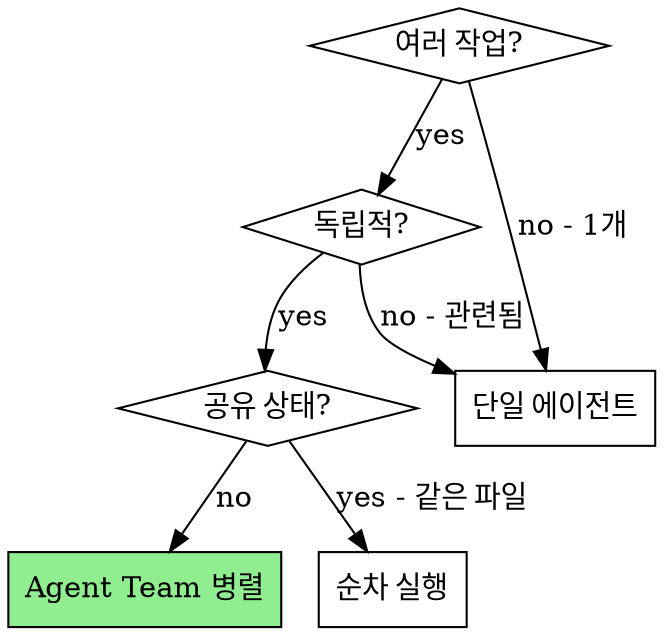
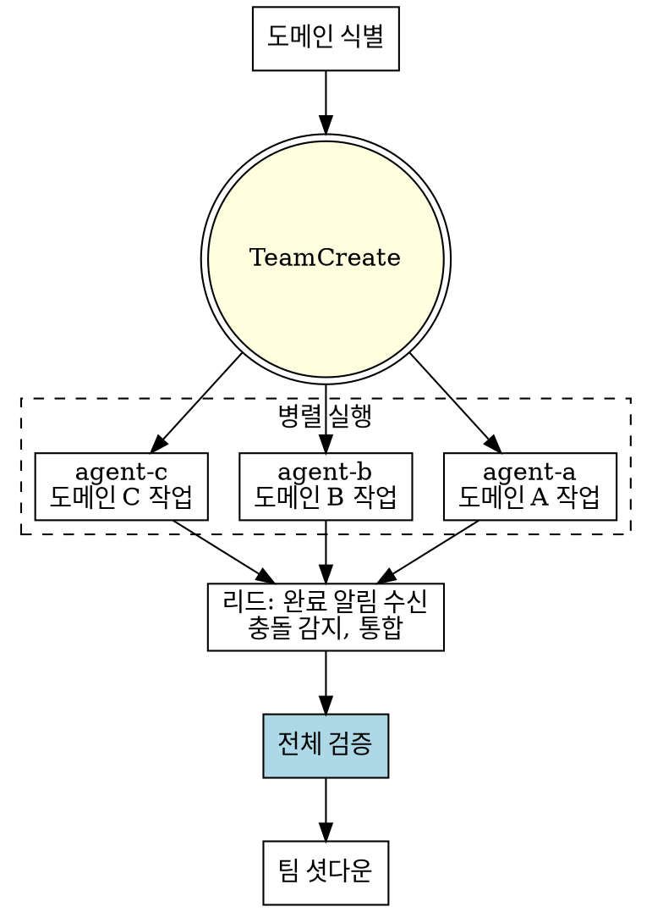

# Dispatching Parallel Agents

## Overview

여러 독립적인 작업(다른 테스트 파일, 다른 서브시스템, 다른 버그)이 있을 때 Agent Team으로 병렬 실행합니다.
에이전트끼리 진행 상황을 공유하고, 예상치 못한 관련 이슈를 발견하면 소통할 수 있습니다.

**Core principle:** 독립적인 문제 도메인당 하나의 에이전트. 팀으로 묶어 병렬 실행 + 소통 가능.

**Announce at start:** "dispatching-parallel-agents 스킬을 사용하여 Agent Team으로 병렬 작업을 진행합니다."

## vs. Previous Approach (Fire-and-Forget)

| 이전 (Task 병렬 fire-and-forget) | 현재 (Agent Team) |
|---|---|
| Task 발사 후 전부 끝날 때까지 대기 | **에이전트별 완료 알림 즉시 수신** |
| 에이전트끼리 서로 모름 | **관련 이슈 발견 시 SendMessage 가능** |
| 결과 수집만 가능 | **진행 중 소통 + 충돌 조기 감지** |
| 진행 상황 불투명 | **idle 알림으로 실시간 상태 파악** |

## When to Use



**Use when:**
- 2+ 작업이 **다른 파일/서브시스템**에서 독립적으로 진행 가능
- 각 작업을 다른 것의 컨텍스트 없이 이해 가능
- 작업 간 공유 상태 없음

**Don't use when:**
- 작업이 관련됨 (하나 고치면 다른 것도 해결될 수 있음)
- 같은 파일을 여러 에이전트가 수정해야 함
- 전체 시스템 상태 이해가 필요

## The Process



## Step 1: Identify Independent Domains

작업을 문제별로 그룹화:
- Domain A: Tool approval flow (file-a.test.ts)
- Domain B: Batch completion (file-b.test.ts)
- Domain C: Abort functionality (file-c.test.ts)

각 도메인은 독립적 — Domain A 수정이 Domain C에 영향 없음.

## Step 2: Create Team

```
TeamCreate(
  team_name: "parallel-{context}",
  description: "Parallel fix for {context}"
)
```

## Step 3: Spawn Agents (병렬)

도메인당 하나의 에이전트를 **동시에** 스폰:

```
# 동시에 스폰 — 단일 메시지에 모든 Task 호출
Task(
  team_name: "parallel-{context}",
  name: "agent-a",
  subagent_type: "general-purpose",
  prompt: "[에이전트 프롬프트]"
)

Task(
  team_name: "parallel-{context}",
  name: "agent-b",
  subagent_type: "general-purpose",
  prompt: "[에이전트 프롬프트]"
)

Task(
  team_name: "parallel-{context}",
  name: "agent-c",
  subagent_type: "general-purpose",
  prompt: "[에이전트 프롬프트]"
)
```

### Agent Prompt Structure

좋은 에이전트 프롬프트:

```markdown
You are **agent-a** in a parallel Agent Team.

## Your Task
Fix the 3 failing tests in src/agents/agent-tool-abort.test.ts:
1. "should abort tool with partial output capture"
2. "should handle mixed completed and aborted tools"
3. "should properly track pendingToolCount"

## Context
These are timing/race condition issues in the abort flow.

## Constraints
- 이 도메인(abort)의 파일만 수정
- 다른 도메인 코드 변경 금지

## Team Communication
- 관련 이슈를 발견하면 다른 에이전트에게 SendMessage
  팀 설정: ~/.claude/teams/{team-name}/config.json
- 완료 시 lead에게 결과 보고:
  SendMessage(type: "message", recipient: "lead",
    content: "완료 보고: [발견 + 수정 사항]",
    summary: "Domain A 완료")

## Deliverable
- 수정 완료 + 테스트 통과 확인
- 변경 파일 목록
- 발견한 근본 원인 설명
```

**필수 포함 사항:**
1. **Focused scope** — 하나의 명확한 도메인
2. **Context** — 문제 이해에 필요한 모든 정보
3. **Constraints** — 다른 도메인 침범 금지
4. **Team communication** — SendMessage로 보고 + 관련 이슈 공유
5. **Deliverable** — 무엇을 반환해야 하는지

## Step 4: Monitor and Coordinate

리드는 에이전트 완료 알림을 **비동기로** 수신합니다:

```
# 각 에이전트가 완료 시 자동으로 메시지 수신
# 리드가 기다리는 동안 에이전트들은 병렬 실행 중

# 에이전트 A 완료 알림 수신 → 결과 확인
# 에이전트 B 완료 알림 수신 → 결과 확인
# 에이전트 C 완료 알림 수신 → 결과 확인
```

**에이전트가 관련 이슈 발견 시:**
```
# agent-a가 agent-b에 영향주는 문제 발견
agent-a → SendMessage("agent-b", "abort flow에서 batch state 관련 이슈 발견. 확인 필요.")
# agent-b가 알림 수신 후 자체적으로 대응
```

## Step 5: Review and Integrate

모든 에이전트 완료 후:

1. **각 결과 검토** — 무엇이 변경됐는지 이해
2. **충돌 확인** — 에이전트들이 같은 코드를 수정했는지
3. **전체 테스트 실행:**
```bash
npm test  # 모든 수정이 함께 작동하는지 확인
```
4. **충돌 있으면** — 리드가 수동 통합 또는 추가 에이전트 디스패치

## Step 6: Shutdown

```
SendMessage(type: "shutdown_request", recipient: "agent-a")
SendMessage(type: "shutdown_request", recipient: "agent-b")
SendMessage(type: "shutdown_request", recipient: "agent-c")

TeamDelete()
```

## Common Mistakes

**❌ Too broad:** "Fix all the tests" — 에이전트가 길을 잃음
**✅ Specific:** "Fix agent-tool-abort.test.ts" — 집중된 범위

**❌ No constraints:** 에이전트가 다른 도메인 코드를 리팩토링할 수 있음
**✅ Constraints:** "이 도메인의 파일만 수정"

**❌ No team communication:** 관련 이슈 발견해도 공유 불가
**✅ SendMessage:** 팀원에게 직접 알림 가능

**❌ Overlapping domains:** 같은 파일을 여러 에이전트가 수정
**✅ Clear boundaries:** 도메인별 파일 범위 명확히 분리

## When NOT to Use

**Related failures:** 하나 고치면 다른 것도 고쳐질 수 있음 — 먼저 함께 조사
**Need full context:** 전체 시스템을 봐야 이해 가능
**Exploratory debugging:** 무엇이 고장났는지 아직 모름
**Shared state:** 같은 파일 편집, 같은 리소스 사용

## 관련 스킬

- **subagent-driven-development**: 파이프라인 실행 (구현→리뷰 순차)
- **executing-plans**: 계획 실행 시 병렬 가능한 Task 식별
- **systematic-debugging**: 문제 원인 조사 (병렬 전에 먼저)
