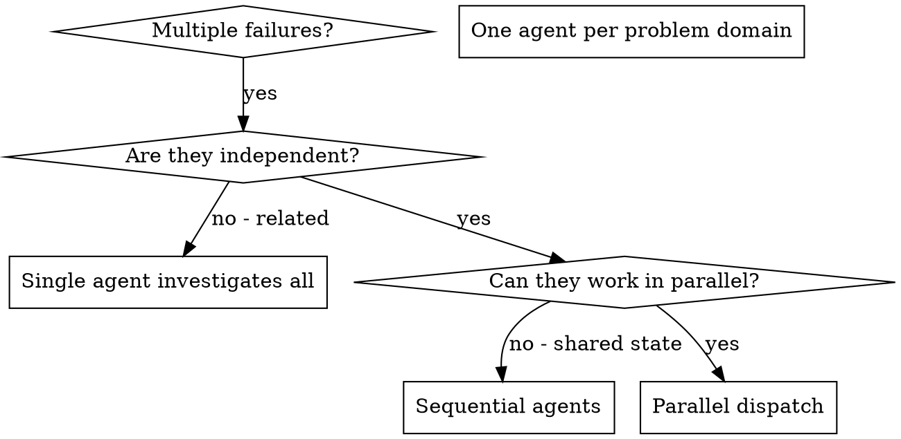

# Dispatching Parallel Agents

## Overview

여러 독립적인 실패(다른 테스트 파일, 다른 서브시스템, 다른 버그)가 있을 때 순차적으로 조사하면 시간 낭비입니다. 각 조사는 독립적이고 병렬로 진행할 수 있습니다.

**Core principle:** 독립적인 문제 도메인당 하나의 에이전트를 디스패치. 동시에 작업.

**Announce at start:** "dispatching-parallel-agents 스킬을 사용하여 병렬로 작업을 진행합니다."

## When to Use



**Use when:**
- 3+ 테스트 파일이 다른 원인으로 실패
- 여러 서브시스템이 독립적으로 고장
- 각 문제를 다른 것의 컨텍스트 없이 이해 가능
- 조사 간 공유 상태 없음

**Don't use when:**
- 실패가 관련됨 (하나 고치면 다른 것도 해결될 수 있음)
- 전체 시스템 상태 이해 필요
- 에이전트끼리 간섭할 수 있음

## The Pattern

### 1. Identify Independent Domains

실패를 문제별로 그룹화:
- File A tests: Tool approval flow
- File B tests: Batch completion behavior
- File C tests: Abort functionality

각 도메인은 독립적 - tool approval 수정이 abort 테스트에 영향 없음.

### 2. Create Focused Agent Tasks

각 에이전트에게:
- **Specific scope:** 하나의 테스트 파일 또는 서브시스템
- **Clear goal:** 이 테스트들 통과시키기
- **Constraints:** 다른 코드 변경 금지
- **Expected output:** 발견 및 수정 사항 요약

### 3. Dispatch in Parallel

```typescript
// Claude Code 환경에서
Task("Fix agent-tool-abort.test.ts failures")
Task("Fix batch-completion-behavior.test.ts failures")
Task("Fix tool-approval-race-conditions.test.ts failures")
// 세 개 모두 동시 실행
```

### 4. Review and Integrate

에이전트 반환 시:
- 각 요약 읽기
- 수정사항 충돌 여부 확인
- 전체 테스트 스위트 실행
- 모든 변경 통합

## Agent Prompt Structure

좋은 에이전트 프롬프트:
1. **Focused** - 하나의 명확한 문제 도메인
2. **Self-contained** - 문제 이해에 필요한 모든 컨텍스트
3. **Specific about output** - 에이전트가 무엇을 반환해야 하는지

```markdown
Fix the 3 failing tests in src/agents/agent-tool-abort.test.ts:

1. "should abort tool with partial output capture" - expects 'interrupted at' in message
2. "should handle mixed completed and aborted tools" - fast tool aborted instead of completed
3. "should properly track pendingToolCount" - expects 3 results but gets 0

These are timing/race condition issues. Your task:

1. Read the test file and understand what each test verifies
2. Identify root cause - timing issues or actual bugs?
3. Fix by:
   - Replacing arbitrary timeouts with event-based waiting
   - Fixing bugs in abort implementation if found
   - Adjusting test expectations if testing changed behavior

Do NOT just increase timeouts - find the real issue.

Return: Summary of what you found and what you fixed.
```

## Common Mistakes

**❌ Too broad:** "Fix all the tests" - 에이전트가 길을 잃음
**✅ Specific:** "Fix agent-tool-abort.test.ts" - 집중된 범위

**❌ No context:** "Fix the race condition" - 에이전트가 위치 모름
**✅ Context:** 에러 메시지와 테스트 이름 붙여넣기

**❌ No constraints:** 에이전트가 모든 것을 리팩토링할 수 있음
**✅ Constraints:** "프로덕션 코드 변경 금지" 또는 "테스트만 수정"

**❌ Vague output:** "고쳐라" - 무엇이 변경됐는지 모름
**✅ Specific:** "원인과 변경사항 요약 반환"

## When NOT to Use

**Related failures:** 하나 고치면 다른 것도 고쳐질 수 있음 - 먼저 함께 조사
**Need full context:** 전체 시스템을 봐야 이해 가능
**Exploratory debugging:** 무엇이 고장났는지 아직 모름
**Shared state:** 에이전트끼리 간섭 (같은 파일 편집, 같은 리소스 사용)

## Key Benefits

1. **Parallelization** - 여러 조사 동시 진행
2. **Focus** - 각 에이전트가 좁은 범위, 추적할 컨텍스트 적음
3. **Independence** - 에이전트끼리 간섭 없음
4. **Speed** - 3개 문제를 1개 시간에 해결

## Verification

에이전트 반환 후:
1. **각 요약 검토** - 무엇이 변경됐는지 이해
2. **충돌 확인** - 에이전트들이 같은 코드 편집했나?
3. **전체 스위트 실행** - 모든 수정이 함께 작동하는지 확인
4. **Spot check** - 에이전트도 체계적 오류 가능

## 관련 스킬

- **executing-plans**: 계획 실행 시 병렬 가능한 Task 식별
- **subagent-driven-development**: 서브에이전트 기반 개발
