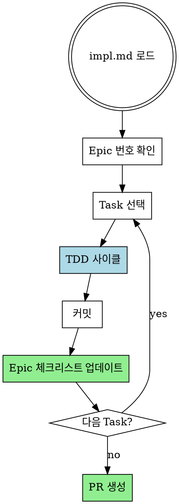

# Executing Plans

## Overview

impl.md의 Task를 순서대로 TDD로 실행하고, GitHub Epic 체크리스트를 업데이트합니다.

**Core principle:** 각 Task는 TDD 사이클. Epic 체크리스트로 진행 추적.

**Announce at start:** "executing-plans 스킬을 사용하여 impl.md를 실행합니다."

## The Process



## 컨텍스트 복구 (/clear 후 시작 시)

```
/clear 후 사용자 입력 예시:
- "#43 구현해줘"
- "#43 Task 3부터 이어서 해줘"
- "impl.md 실행해줘"

복구 순서:
1. GitHub Issue 번호가 있으면 → `gh issue view #N` 으로 Epic 로드
2. Task 번호가 있으면 → 해당 Task부터 시작
3. 파일 경로가 있으면 → 해당 impl.md 읽기
4. Epic 체크리스트에서 미완료 Task 확인 후 재개
```

## Step 1: Load and Review Plan

**1. 계획 로드:**
```bash
# impl.md에서 Epic 번호 추출
EPIC_NUMBER=$(grep -oP '(?<=GitHub Epic:\*\* #)\d+' docs/plans/*-impl.md)

# Epic 상태 확인 (체크리스트에서 진행 상황 파악)
gh issue view $EPIC_NUMBER
```

**2. 비판적 검토:**
- 계획을 읽고 질문/우려사항 식별
- 우려가 있으면: **시작 전에 사용자에게 제기**
- 우려가 없으면: TodoWrite 생성 후 진행

**3. Worktree 설정 (REQUIRED):**
- **REQUIRED:** Use using-git-worktrees 스킬
- main/master에서 직접 작업 금지
- 격리된 worktree에서 작업

## Step 2: Execute Tasks (TDD)

각 Task마다:

1. **Mark in_progress** (TodoWrite 또는 Task tool)
2. **REQUIRED:** Use test-driven-development 스킬
   - RED: Failing test 작성 및 실패 확인
   - GREEN: 최소 코드로 통과
   - REFACTOR: 정리
3. **커밋:**
   ```bash
   git commit -m "feat: [task description]

   Refs #$EPIC_NUMBER"
   ```
4. **Epic 체크리스트 업데이트:**
   ```bash
   # Epic body에서 해당 Task 체크
   gh issue edit $EPIC_NUMBER --body "$(gh issue view $EPIC_NUMBER --json body -q .body | sed 's/- \[ \] Task N/- [x] Task N/')"
   ```
5. **Mark completed**

## Step 3: Batch Checkpoint

3개 Task마다 중간 보고:
- 완료된 Task 목록
- 테스트 통과 상태
- "피드백 주세요."

## Step 4: Complete

모든 Task 완료 후:

1. **최종 검증:**
   ```bash
   npm test  # 또는 프로젝트 테스트 명령
   npm run build  # 또는 프로젝트 빌드 명령
   ```

2. **PR 생성:**
   - **REQUIRED:** Use creating-prs 스킬
   - PR에서 `Closes #$EPIC_NUMBER` 포함

## When to Stop

**즉시 멈추고 질문:**
- 테스트가 실패하는데 이유를 모를 때
- impl.md 지시가 불명확할 때
- 의존성이 누락되었을 때
- 계획에 치명적 결함 발견

**추측하지 말고 질문하세요.**

## When to Revisit Step 1

**계획 재검토 필요:**
- 사용자가 피드백 기반으로 계획 수정
- 근본적 접근법 재고 필요

**Blocker 강행 금지** - 멈추고 질문

## Remember

- 계획을 비판적으로 먼저 검토
- 계획 단계를 정확히 따르기
- 검증 단계 건너뛰지 않기
- 계획이 스킬 참조하면 해당 스킬 사용
- 배치 사이: 보고만 하고 대기
- **main/master 브랜치에서 직접 구현 시작 금지** (명시적 동의 없이)

## 관련 스킬

- **writing-plans**: impl.md 생성 (이전 단계)
- **using-git-worktrees**: 격리된 작업 공간 (REQUIRED)
- **test-driven-development**: 각 Task TDD 실행
- **verification**: 완료 전 검증
- **creating-prs**: PR 생성 (다음 단계)
- **closing-issues**: Epic 종료
