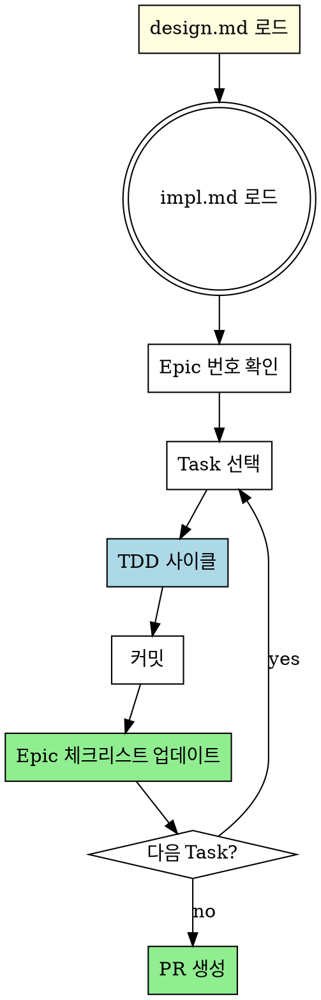

# Executing Plans

## Overview

impl.md의 Task를 실행하고, GitHub Epic 체크리스트를 업데이트합니다.
Task 의존성을 분석하여 **순차 파이프라인, 병렬 팀, 수동 실행** 중 최적 방식을 선택합니다.

**Core principle:** 의존성 분석 → 최적 실행 방식 선택 → TDD → Epic 추적.

**Announce at start:** "executing-plans 스킬을 사용하여 impl.md를 실행합니다."

## Step 0: Load Design Document

**impl.md 헤더의 `Design Document` 링크를 확인하고, design.md를 읽습니다.**

```
**Design Document:** [design-md](YYYY-MM-DD-<topic>-design.md)
```

- design.md 링크가 있으면 **반드시 먼저 읽어서** 전체 설계 컨텍스트를 파악
- impl.md의 각 Task에 `Design Reference` 섹션이 있으면 해당 design.md 섹션과 대조
- design.md가 없으면 impl.md만으로 진행

**에이전트 팀 사용 시:** lead가 design.md를 읽고, Task 할당 메시지에 관련 스펙을 포함하여 전달

## The Process



## Step 0: Load Stack Patterns (if applicable)

프로젝트 스택 감지 후 해당 패턴 스킬 참조:

| 감지 방법 | 스킬 |
|-----------|------|
| `next.config.*` 또는 `package.json`에 `next` | **nextjs-frontend** |
| `nest-cli.json` 또는 `package.json`에 `@nestjs/core` | **nestjs-backend** |
| `pyproject.toml`에 `fastapi` 또는 `requirements.txt`에 `fastapi` | **fastapi-backend** |

**감지되면:** 해당 스킬의 패턴/컨벤션을 코드 작성 시 따름

## Step 0: Analyze Task Dependencies

**impl.md를 로드한 후, Task 간 의존성을 분석합니다:**

```
Task 1: DB 스키마 마이그레이션       ← 독립
Task 2: API 엔드포인트 구현          ← Task 1 의존
Task 3: 프론트엔드 컴포넌트          ← 독립
Task 4: API 통합 테스트              ← Task 2 의존
Task 5: E2E 테스트                   ← Task 2, 3 의존
```

**의존성 판단 기준:**
- Task B가 Task A의 **출력 파일**을 사용하면 → 의존
- Task B가 Task A의 **인터페이스/타입**을 참조하면 → 의존
- 서로 **다른 파일/모듈**에서 독립적이면 → 독립

**분석 결과를 사용자에게 제시:**
```
의존성 분석 결과:
- 독립 그룹 A: Task 1, Task 3 (병렬 가능)
- 순차 체인 B: Task 2 → Task 4 (Task 1 이후)
- 순차 체인 C: Task 5 (Task 2, 3 이후)

추천: Agent Team 병렬 (독립 Task를 동시 실행, 의존 Task는 순차)
```

## Step 0: Choose Execution Mode

**의존성 분석 결과에 따라 실행 방식 추천 (AskUserQuestion):**

```
AskUserQuestion:
"구현 계획을 실행하는 방식을 선택해주세요:"

옵션:
1. Agent Team 파이프라인 (Recommended - 대부분의 경우)
   - subagent-driven-development 스킬 사용
   - 순차 실행 + 리뷰 파이프라인 (implementer → spec → quality)
   - Task 간 의존성이 많을 때 적합
   - 현재 브랜치에서 작업 (worktree 비호환)
2. Agent Team 병렬 (독립 Task가 많을 때)
   - dispatching-parallel-agents 스킬 사용
   - 독립 Task는 동시 실행, 의존 Task는 순차 대기
   - Task의 50% 이상이 독립적일 때 적합
   - 현재 브랜치에서 작업 (worktree 비호환)
3. 수동 실행 (워크트리 격리) - 단계별 직접 제어
   - executing-plans 스킬로 계속
   - worktree로 격리된 브랜치에서 작업
   - Agent Team 사용 불가
```

**Agent Team 파이프라인 선택 시:**
- **REQUIRED:** Use subagent-driven-development 스킬
- TeamCreate로 파이프라인 팀 구성
- worktree 설정 건너뛰기 (비호환)
- 현재 브랜치 확인 (main/master이면 새 브랜치 생성)

**Agent Team 병렬 선택 시:**
- **REQUIRED:** Use dispatching-parallel-agents 스킬
- 의존성 그래프에 따라 실행 순서 결정:
  1. 독립 Task들을 병렬 에이전트로 동시 실행
  2. 의존 Task는 선행 Task 완료 후 순차 실행
  3. 각 wave 완료 시 Epic 체크리스트 업데이트
- 현재 브랜치 확인 (main/master이면 새 브랜치 생성)

**수동 실행 선택 시:**
- **REQUIRED:** Use using-git-worktrees 스킬
- Agent Team 사용 금지
- 이 스킬로 계속 진행

## Step 1: Load and Review Plan

**1. 계획 로드:**
```bash
# impl.md에서 Epic 번호 추출
EPIC_NUMBER=$(grep -oP '(?<=GitHub Epic:\*\* #)\d+' .claude/github-superpowers/plans/*-impl.md)

# Epic 상태 확인 (체크리스트에서 진행 상황 파악)
gh issue view $EPIC_NUMBER
```

**2. 비판적 검토:**
- 계획을 읽고 질문/우려사항 식별
- 우려가 있으면: **시작 전에 사용자에게 제기**
- 우려가 없으면: TodoWrite 생성 후 진행

**3. Worktree 설정 (수동 실행 모드만):**
- **수동 실행 선택 시:** Use using-git-worktrees 스킬
- main/master에서 직접 작업 금지
- 격리된 worktree에서 작업
- **Agent Team 모드에서는 건너뛰기** (비호환)

## Step 2: Execute Tasks (TDD)

각 Task마다:

1. **Mark in_progress** (TodoWrite 또는 Task tool)
2. **REQUIRED:** Use test-driven-development 스킬
   - RED: Failing test 작성 및 실패 확인
   - GREEN: 최소 코드로 통과
   - REFACTOR: 정리
3. **커밋:**
   ```bash
   git commit -m "feat: [task description]

   Refs #$EPIC_NUMBER"
   ```
4. **Epic 체크리스트 업데이트:**
   ```bash
   # Epic body에서 해당 Task 체크
   gh issue edit $EPIC_NUMBER --body "$(gh issue view $EPIC_NUMBER --json body -q .body | sed 's/- \[ \] Task N/- [x] Task N/')"
   ```
5. **Mark completed**

## Step 3: Batch Checkpoint

3개 Task마다 중간 보고:
- 완료된 Task 목록
- 테스트 통과 상태
- "피드백 주세요."

## Step 4: Complete

모든 Task 완료 후:

1. **최종 검증:**
   ```bash
   npm test  # 또는 프로젝트 테스트 명령
   npm run build  # 또는 프로젝트 빌드 명령
   ```

2. **PR 생성:**
   - **REQUIRED:** Use creating-prs 스킬
   - PR에서 `Closes #$EPIC_NUMBER` 포함

## When to Stop

**즉시 멈추고 질문:**
- 테스트가 실패하는데 이유를 모를 때
- impl.md 지시가 불명확할 때
- 의존성이 누락되었을 때
- 계획에 치명적 결함 발견

**추측하지 말고 질문하세요.**

## When to Revisit Step 1

**계획 재검토 필요:**
- 사용자가 피드백 기반으로 계획 수정
- 근본적 접근법 재고 필요

**Blocker 강행 금지** - 멈추고 질문

## Remember

- 계획을 비판적으로 먼저 검토
- 계획 단계를 정확히 따르기
- 검증 단계 건너뛰지 않기
- 계획이 스킬 참조하면 해당 스킬 사용
- 배치 사이: 보고만 하고 대기
- **main/master 브랜치에서 직접 구현 시작 금지** (명시적 동의 없이)

## 관련 스킬

**실행 방식:**
- **subagent-driven-development**: Agent Team 파이프라인 실행 (순차 + 리뷰)
- **dispatching-parallel-agents**: Agent Team 병렬 실행 (독립 Task 동시)
- **using-git-worktrees**: 격리된 작업 공간 (수동 실행 시 REQUIRED)
- 위 3가지 모두 worktree와 비호환 (수동 실행 제외)

**구현:**
- **writing-plans**: impl.md 생성 (이전 단계)
- **test-driven-development**: 각 Task TDD 실행
- **verification**: 완료 전 검증
- **creating-prs**: PR 생성 (다음 단계)
- **closing-issues**: Epic 종료

**스택별 패턴 (자동 감지):**
- **nextjs-frontend**: Next.js + FSD + shadcn/ui
- **nestjs-backend**: NestJS + Hexagonal Architecture
- **fastapi-backend**: FastAPI + Celery
