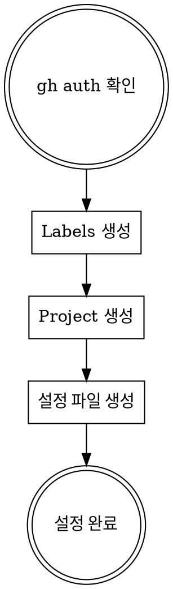

# GitHub Superpowers 초기 설정

새 저장소에서 github-superpowers 워크플로우를 사용하기 전 필수 설정입니다.

**Announce at start:** "init-github-superpowers 스킬을 사용하여 GitHub 프로젝트를 초기화합니다."

## 워크플로우



## 1. gh CLI 인증 확인

```bash
gh auth status
```

인증 안 됨 → `gh auth login` 실행

## 2. Labels 생성

```bash
# 필수 라벨
gh label create "design" --color "0E8A16" --description "설계 문서"
gh label create "epic" --color "5319E7" --description "Epic (상위 이슈)"
gh label create "feat" --color "1D76DB" --description "새 기능"
gh label create "fix" --color "D73A4A" --description "버그 수정"
gh label create "refactor" --color "FEF2C0" --description "리팩토링"
```

## 3. Project 생성

```bash
# Project 생성 (Organization 또는 User)
gh project create --owner <owner> --title "<project-name>"

# Project 번호 확인
gh project list --owner <owner>
```

### Project 커스텀 필드 설정 (필수)

```bash
PROJECT_ID=$(gh project list --owner <owner> --format json | jq -r '.projects[] | select(.title=="<project-name>") | .id')

# Start Date 필드
gh project field-create $PROJECT_ID \
  --owner <owner> \
  --name "Start Date" \
  --data-type DATE

# End Date 필드
gh project field-create $PROJECT_ID \
  --owner <owner> \
  --name "End Date" \
  --data-type DATE

# Status 필드 (기본 제공되지만 커스텀 가능)
# Priority 필드
gh project field-create $PROJECT_ID \
  --owner <owner> \
  --name "Priority" \
  --data-type SINGLE_SELECT \
  --single-select-options "High,Medium,Low"

# Issue Type 필드
gh project field-create $PROJECT_ID \
  --owner <owner> \
  --name "Issue Type" \
  --data-type SINGLE_SELECT \
  --single-select-options "design,feat,fix,refactor,epic"
```

**필수 필드:**
| 필드 | 타입 | 용도 |
|------|------|------|
| Start Date | DATE | 작업 시작일 |
| End Date | DATE | 작업 완료 예정일 |
| Status | SINGLE_SELECT | Todo, In Progress, Done |
| Priority | SINGLE_SELECT | High, Medium, Low |
| Issue Type | SINGLE_SELECT | design, feat, fix, refactor, epic |

## 4. 필드 ID 조회 및 설정 파일 생성

```bash
# 필드 ID 조회
FIELDS=$(gh project field-list $PROJECT_NUMBER --owner <owner> --format json)
START_DATE_ID=$(echo "$FIELDS" | jq -r '.fields[] | select(.name=="Start Date") | .id')
END_DATE_ID=$(echo "$FIELDS" | jq -r '.fields[] | select(.name=="End Date") | .id')
PRIORITY_ID=$(echo "$FIELDS" | jq -r '.fields[] | select(.name=="Priority") | .id')

# Priority 옵션 ID 조회
PRIORITY_OPTIONS=$(gh api graphql -f query='
  query($projectId: ID!) {
    node(id: $projectId) {
      ... on ProjectV2 {
        field(name: "Priority") {
          ... on ProjectV2SingleSelectField {
            options { id name }
          }
        }
      }
    }
  }' -f projectId="$PROJECT_ID" --jq '.data.node.field.options')

HIGH_ID=$(echo "$PRIORITY_OPTIONS" | jq -r '.[] | select(.name=="High") | .id')
MEDIUM_ID=$(echo "$PRIORITY_OPTIONS" | jq -r '.[] | select(.name=="Medium") | .id')
LOW_ID=$(echo "$PRIORITY_OPTIONS" | jq -r '.[] | select(.name=="Low") | .id')

# Issue Type 필드 ID 조회
ISSUE_TYPE_ID=$(echo "$FIELDS" | jq -r '.fields[] | select(.name=="Issue Type") | .id')

# Issue Type 옵션 ID 조회
ISSUE_TYPE_OPTIONS=$(gh api graphql -f query='
  query($projectId: ID!) {
    node(id: $projectId) {
      ... on ProjectV2 {
        field(name: "Issue Type") {
          ... on ProjectV2SingleSelectField {
            options { id name }
          }
        }
      }
    }
  }' -f projectId="$PROJECT_ID" --jq '.data.node.field.options')

DESIGN_TYPE_ID=$(echo "$ISSUE_TYPE_OPTIONS" | jq -r '.[] | select(.name=="design") | .id')
FEAT_TYPE_ID=$(echo "$ISSUE_TYPE_OPTIONS" | jq -r '.[] | select(.name=="feat") | .id')
FIX_TYPE_ID=$(echo "$ISSUE_TYPE_OPTIONS" | jq -r '.[] | select(.name=="fix") | .id')
REFACTOR_TYPE_ID=$(echo "$ISSUE_TYPE_OPTIONS" | jq -r '.[] | select(.name=="refactor") | .id')
EPIC_TYPE_ID=$(echo "$ISSUE_TYPE_OPTIONS" | jq -r '.[] | select(.name=="epic") | .id')
```

`.github/github-superpowers.json` 생성:

```json
{
  "project": {
    "owner": "<owner>",
    "number": <project-number>,
    "id": "<project-id>",
    "fields": {
      "startDate": { "name": "Start Date", "id": "<field-id>" },
      "endDate": { "name": "End Date", "id": "<field-id>" },
      "priority": {
        "name": "Priority",
        "id": "<field-id>",
        "options": {
          "high": "<option-id>",
          "medium": "<option-id>",
          "low": "<option-id>"
        }
      },
      "issueType": {
        "name": "Issue Type",
        "id": "<field-id>",
        "options": {
          "design": "<option-id>",
          "feat": "<option-id>",
          "fix": "<option-id>",
          "refactor": "<option-id>",
          "epic": "<option-id>"
        }
      }
    }
  },
  "milestones": {
    "current": null,
    "strategy": "version"
  },
  "labels": {
    "design": "design",
    "epic": "epic"
  }
}
```

**milestones.current가 null인 경우:**
- brainstorming 완료 시 Milestone 선택 질문
- 또는 기존 Milestone 중 선택

## 설정 확인

```bash
# Labels 확인
gh label list

# Milestones 확인
gh api repos/{owner}/{repo}/milestones --jq '.[].title'

# Project 확인
gh project list --owner <owner>
```

## 다음 단계

**Milestone 설정:**
- `/milestone create` 로 첫 마일스톤 생성
- 또는 나중에 brainstorming 시 선택

## 관련 스킬

- **milestone**: 마일스톤 생성/전환/종료
- **brainstorming**: 설정 완료 후 첫 설계 시작
- **using-github-superpowers**: 전체 워크플로우
