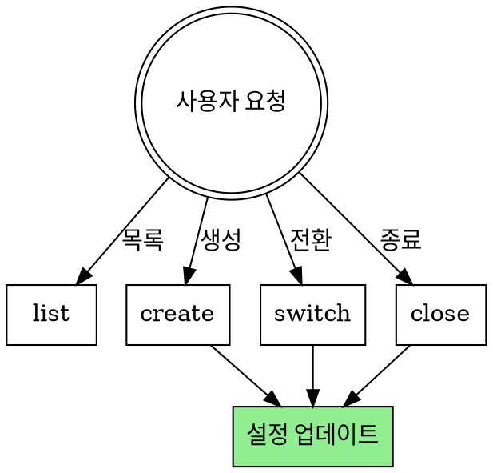

# Milestone 관리

마일스톤 생성, 전환, 종료를 관리합니다.

**Announce at start:** "milestone 스킬을 사용하여 마일스톤을 관리합니다."

## 워크플로우



## 명령어

### list - 마일스톤 목록

```bash
# 열린 마일스톤
gh api repos/{owner}/{repo}/milestones --jq '.[] | "\(.number): \(.title) (\(.open_issues) open, \(.closed_issues) closed)"'

# 닫힌 마일스톤 포함
gh api repos/{owner}/{repo}/milestones?state=all --jq '.[] | "\(.title) [\(.state)]"'
```

### create - 새 마일스톤 생성

**사용자에게 질문:**
```
마일스톤 정보를 입력해주세요:

1. 제목 (예: v1.0.0, 2025 Q1, Sprint 1)
2. 설명 (선택)
3. 마감일 (선택, YYYY-MM-DD)
```

```bash
gh api repos/{owner}/{repo}/milestones \
  -f title="<title>" \
  -f description="<description>" \
  -f due_on="<YYYY-MM-DD>T00:00:00Z"
```

**생성 후 질문:**
```
이 마일스톤을 현재 마일스톤으로 설정할까요?

1. 예 - github-superpowers.json 업데이트
2. 아니오 - 목록에만 추가
```

### switch - 현재 마일스톤 전환

```bash
# 현재 설정 확인
jq -r '.milestones.current' .github/github-superpowers.json

# 마일스톤 목록에서 선택
gh api repos/{owner}/{repo}/milestones --jq '.[].title'
```

**github-superpowers.json 업데이트:**
```bash
jq '.milestones.current = "<new-milestone>"' .github/github-superpowers.json > tmp.json
mv tmp.json .github/github-superpowers.json
```

### close - 마일스톤 종료

```bash
# 마일스톤 번호 조회
MILESTONE_NUMBER=$(gh api repos/{owner}/{repo}/milestones --jq '.[] | select(.title=="<title>") | .number')

# 마일스톤 종료
gh api repos/{owner}/{repo}/milestones/$MILESTONE_NUMBER \
  -X PATCH \
  -f state="closed"
```

**종료 후 질문:**
```
다음 마일스톤을 현재 마일스톤으로 설정할까요?

1. [다음 마일스톤 목록...]
2. null로 설정 (다음 설계 시 선택)
```

## 관련 스킬

- **setup**: 초기 프로젝트 설정
- **brainstorming**: 마일스톤이 null이면 선택 질문
