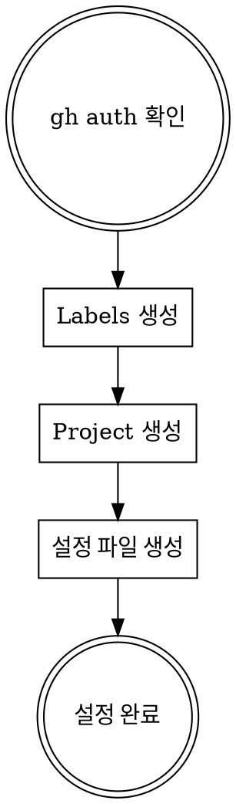

# GitHub Superpowers 초기 설정

새 저장소에서 github-superpowers 워크플로우를 사용하기 전 필수 설정입니다.

**Announce at start:** "setup 스킬을 사용하여 GitHub 프로젝트를 초기화합니다."

## 워크플로우



## 1. gh CLI 인증 확인

```bash
gh auth status
```

인증 안 됨 → `gh auth login` 실행

## 2. Labels 생성

```bash
# 필수 라벨
gh label create "design" --color "0E8A16" --description "설계 문서"
gh label create "epic" --color "5319E7" --description "Epic (상위 이슈)"
gh label create "feat" --color "1D76DB" --description "새 기능"
gh label create "fix" --color "D73A4A" --description "버그 수정"
gh label create "refactor" --color "FEF2C0" --description "리팩토링"
```

## 3. Project 생성

```bash
# Project 생성 (Organization 또는 User)
gh project create --owner <owner> --title "<project-name>"

# Project 번호 확인
gh project list --owner <owner>
```

### Project 커스텀 필드 설정 (필수)

```bash
PROJECT_ID=$(gh project list --owner <owner> --format json | jq -r '.projects[] | select(.title=="<project-name>") | .id')

# Start Date 필드
gh project field-create $PROJECT_ID \
  --owner <owner> \
  --name "Start Date" \
  --data-type DATE

# End Date 필드
gh project field-create $PROJECT_ID \
  --owner <owner> \
  --name "End Date" \
  --data-type DATE

# Status 필드 (기본 제공되지만 커스텀 가능)
# Priority 필드
gh project field-create $PROJECT_ID \
  --owner <owner> \
  --name "Priority" \
  --data-type SINGLE_SELECT \
  --single-select-options "High,Medium,Low"
```

**필수 필드:**
| 필드 | 타입 | 용도 |
|------|------|------|
| Start Date | DATE | 작업 시작일 |
| End Date | DATE | 작업 완료 예정일 |
| Status | SINGLE_SELECT | Todo, In Progress, Done |
| Priority | SINGLE_SELECT | High, Medium, Low |

## 4. 설정 파일 생성

`.github/github-superpowers.json` 생성:

```json
{
  "project": {
    "owner": "<owner>",
    "number": <project-number>,
    "fields": {
      "startDate": "Start Date",
      "endDate": "End Date",
      "priority": "Priority"
    }
  },
  "milestones": {
    "current": "<milestone-title>",
    "strategy": "version|quarter|sprint|manual"
  },
  "labels": {
    "design": "design",
    "epic": "epic"
  }
}
```

**milestones.current가 null인 경우:**
- brainstorming 완료 시 Milestone 선택 질문
- 또는 기존 Milestone 중 선택

## 설정 확인

```bash
# Labels 확인
gh label list

# Milestones 확인
gh api repos/{owner}/{repo}/milestones --jq '.[].title'

# Project 확인
gh project list --owner <owner>
```

## 다음 단계

**Milestone 설정:**
- `/milestone create` 로 첫 마일스톤 생성
- 또는 나중에 brainstorming 시 선택

## 관련 스킬

- **milestone**: 마일스톤 생성/전환/종료
- **brainstorming**: 설정 완료 후 첫 설계 시작
- **using-github-superpowers**: 전체 워크플로우
