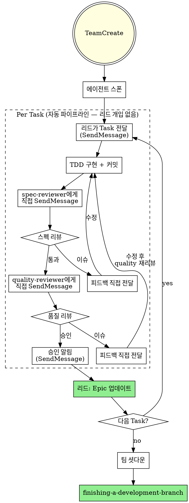

# Agent Team Development

Agent Team을 사용하여 계획을 실행합니다. Implementer → Spec Reviewer → Quality Reviewer 파이프라인이 **직접 통신**하며, 리드는 오케스트레이션에 집중합니다.

**Core principle:** 팀 파이프라인 + 직접 통신 = 리드 컨텍스트 보호, 고품질, 빠른 반복

**Announce at start:** "subagent-driven-development 스킬을 사용하여 Agent Team으로 계획을 실행합니다."

## vs. Sequential Task Dispatches

| 이전 (Task 순차 디스패치) | 현재 (Agent Team) |
|---|---|
| Task마다 새 서브에이전트 생성 | **영속 에이전트** (팀 전체 Task 재사용) |
| 리드가 결과를 수동 복사-중계 | **에이전트 간 직접 SendMessage** |
| 리드 컨텍스트 윈도우 오염 | **리드는 승인 알림만 수신** |
| 리뷰어가 general-purpose | **리뷰어는 Explore (읽기 전용 강제)** |
| 리뷰 피드백도 리드 경유 | **리뷰어↔implementer 직접 피드백 루프** |

## ⚠️ CRITICAL: Git Worktree 비호환

**에이전트는 현재 워킹 디렉토리에서 작업합니다.**

- worktree와 함께 사용 금지
- 격리된 브랜치 필요 시: executing-plans + worktree (수동 실행)

## The Process



## Step 1: Team Setup

### 1.1 Create Team

```
TeamCreate(
  team_name: "impl-{feature-name}",
  description: "Implementation pipeline for {feature-name}"
)
```

### 1.2 Current Branch Check

main/master이면 새 브랜치 생성:
```bash
git checkout -b feat/{feature-name}
```

### 1.3 Spawn Agents

**에이전트 타입 선택 근거:**
- **Implementer** = `general-purpose`: Edit, Write, Bash 필요
- **Reviewers** = `Explore`: **읽기 전용 강제** (리뷰어가 코드 수정 물리적 불가)

```
# 1. Implementer — 코드 작성, 테스트, 커밋
Task(
  team_name: "impl-{feature}",
  name: "implementer",
  subagent_type: "general-purpose",
  prompt: [implementer-prompt.md 내용 + impl.md 전체 텍스트]
)

# 2. Spec Reviewer — 스펙 준수 검증 (읽기 전용)
Task(
  team_name: "impl-{feature}",
  name: "spec-reviewer",
  subagent_type: "Explore",
  prompt: [spec-reviewer-prompt.md 내용]
)

# 3. Quality Reviewer — 코드 품질 검증 (읽기 전용)
Task(
  team_name: "impl-{feature}",
  name: "quality-reviewer",
  subagent_type: "Explore",
  prompt: [code-quality-reviewer-prompt.md 내용]
)
```

**에이전트 초기화:** 각 에이전트는 역할 프롬프트를 읽고 idle 상태로 대기합니다.

## Step 2: Execute Tasks

### 2.1 리드가 Task 전달

```
SendMessage(
  type: "message",
  recipient: "implementer",
  content: "Task N: [task name]

  ## Task Description
  [계획에서 Task 전체 텍스트]

  ## Context
  [어디에 맞는지, 의존성, 아키텍처 컨텍스트]

  ## Epic
  커밋 메시지에 Refs #EPIC_NUMBER 포함",
  summary: "Task N 구현 시작"
)
```

### 2.2 파이프라인 자동 실행 (리드 개입 없음)

```
implementer: TDD 구현 → 커밋 → SendMessage("spec-reviewer", 리뷰 요청)
    ↕ 피드백 루프 (직접 통신)
spec-reviewer: 코드 읽고 검증 → 통과 시 SendMessage("quality-reviewer")
    ↕ 피드백 루프 (직접 통신)
quality-reviewer: 품질 검증 → 승인 시 SendMessage("lead", 승인 알림)
```

**리드는 이 과정에 개입하지 않습니다.** 에이전트끼리 직접 소통합니다.

### 2.3 리뷰 피드백 루프

**스펙 이슈 발견 시:**
```
spec-reviewer → SendMessage("implementer", 피드백) → implementer 수정 → SendMessage("spec-reviewer", 재리뷰 요청)
```

**품질 이슈 발견 시:**
```
quality-reviewer → SendMessage("implementer", 피드백) → implementer 수정 → SendMessage("quality-reviewer", 재리뷰 요청)
```

**피드백 루프 규칙:**
- 스펙 이슈 → spec-reviewer에게 재리뷰 (quality까지 안 감)
- 품질 이슈 → quality-reviewer에게 재리뷰 (spec부터 다시 안 감)
- 승인까지 반복, 건너뛰기 금지

### 2.4 리드: 승인 수신 후 처리

quality-reviewer 승인 알림 수신 시:

1. **Epic 체크리스트 업데이트:**
```bash
gh issue edit $EPIC_NUMBER --body "$(gh issue view $EPIC_NUMBER --json body -q .body | sed 's/- \[ \] Task N/- [x] Task N/')"
```

2. **다음 Task 전달:**
```
SendMessage(
  type: "message",
  recipient: "implementer",
  content: "Task N+1: ..."
  summary: "Task N+1 구현 시작"
)
```

### 2.5 Batch Checkpoint (3개 Task마다)

3개 Task 완료 시 사용자에게 중간 보고:
- 완료된 Task 목록
- 테스트 통과 상태
- "피드백 주세요."

## Step 3: All Tasks Done

### 3.1 최종 검증

```bash
npm test
npm run build
```

### 3.2 팀 셧다운

```
SendMessage(type: "shutdown_request", recipient: "implementer")
SendMessage(type: "shutdown_request", recipient: "spec-reviewer")
SendMessage(type: "shutdown_request", recipient: "quality-reviewer")

TeamDelete()
```

### 3.3 다음 단계

- **REQUIRED:** Use finishing-a-development-branch 스킬
- PR에서 `Closes #$EPIC_NUMBER` 포함

## Red Flags

**Never:**
- **worktree와 함께 사용** (에이전트는 현재 디렉토리에서만 작업)
- 명시적 사용자 동의 없이 main/master 브랜치에서 구현 시작
- 리뷰 건너뛰기 (스펙 준수 또는 코드 품질)
- 수정 안 된 이슈로 진행
- 여러 implementer 병렬 디스패치 (충돌)
- **스펙 준수 ✅ 전에 코드 품질 리뷰 시작** (순서 틀림)
- 리뷰에 열린 이슈 있는 동안 다음 Task로 이동
- 리뷰어가 직접 코드 수정 시도 (Explore 타입이라 물리적 불가)
- implementer 셀프 리뷰가 실제 리뷰 대체 (둘 다 필요)
- 리드가 파이프라인 중간에 불필요하게 개입 (에이전트 자율에 맡기기)

**implementer가 질문하면:**
- 리드가 명확하고 완전하게 답변
- 필요하면 추가 컨텍스트 제공
- 구현으로 서두르지 않기

**리뷰어가 이슈 발견하면:**
- implementer가 수정 → 해당 리뷰어에게 재리뷰 요청
- 승인까지 반복
- 재리뷰 건너뛰지 않기

## Prompt Templates

- `./implementer-prompt.md` - implementer 역할 + 통신 프로토콜
- `./spec-reviewer-prompt.md` - 스펙 리뷰어 역할 + 통신 프로토콜
- `./code-quality-reviewer-prompt.md` - 품질 리뷰어 역할 + 통신 프로토콜

## 관련 스킬

- **writing-plans**: impl.md 생성 (이전 단계)
- **executing-plans**: 실행 방식 선택 시 이 스킬 호출
- **test-driven-development**: implementer가 따르는 TDD
- **finishing-a-development-branch**: 완료 후 처리
- **requesting-code-review**: quality-reviewer 참조 가능
