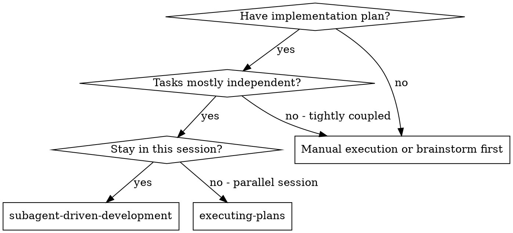
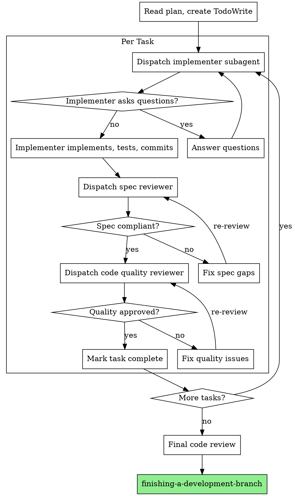

# Subagent-Driven Development

Task별로 새로운 서브에이전트를 디스패치하여 계획을 실행하고, 각 Task 후 두 단계 리뷰: 스펙 준수 리뷰 먼저, 그 다음 코드 품질 리뷰.

**Core principle:** Task별 새로운 서브에이전트 + 두 단계 리뷰 (스펙 그 다음 품질) = 고품질, 빠른 반복

**Announce at start:** "subagent-driven-development 스킬을 사용하여 계획을 실행합니다."

## When to Use



**vs. Executing Plans (parallel session):**
- 같은 세션 (컨텍스트 스위치 없음)
- Task별 새로운 서브에이전트 (컨텍스트 오염 없음)
- 각 Task 후 두 단계 리뷰: 스펙 준수 먼저, 그 다음 코드 품질
- 더 빠른 반복 (Task 간 human-in-loop 없음)

## The Process



## Prompt Templates

- `./implementer-prompt.md` - implementer 서브에이전트 디스패치
- `./spec-reviewer-prompt.md` - 스펙 준수 리뷰어 서브에이전트 디스패치
- `./code-quality-reviewer-prompt.md` - 코드 품질 리뷰어 서브에이전트 디스패치

## GitHub Epic 연동

각 Task 완료 시:
```bash
# Epic 체크리스트 업데이트
gh issue edit $EPIC_NUMBER --body "$(gh issue view $EPIC_NUMBER --json body -q .body | sed 's/- \[ \] Task N/- [x] Task N/')"
```

커밋 메시지:
```bash
git commit -m "feat: [task description]

Refs #$EPIC_NUMBER"
```

## Advantages

**vs. Manual execution:**
- 서브에이전트가 자연스럽게 TDD 따름
- Task별 새로운 컨텍스트 (혼란 없음)
- 병렬 안전 (서브에이전트끼리 간섭 없음)
- 서브에이전트가 질문 가능 (작업 전과 중)

**vs. Executing Plans:**
- 같은 세션 (핸드오프 없음)
- 지속적 진행 (대기 없음)
- 자동 리뷰 체크포인트

**Quality gates:**
- 셀프 리뷰가 핸드오프 전 이슈 잡음
- 두 단계 리뷰: 스펙 준수, 그 다음 코드 품질
- 리뷰 루프가 수정 실제로 작동하는지 확인
- 스펙 준수가 과다/과소 빌드 방지
- 코드 품질이 구현 잘 빌드됐는지 확인

## Red Flags

**Never:**
- 명시적 사용자 동의 없이 main/master 브랜치에서 구현 시작
- 리뷰 건너뛰기 (스펙 준수 또는 코드 품질)
- 수정 안 된 이슈로 진행
- 여러 구현 서브에이전트 병렬 디스패치 (충돌)
- 서브에이전트가 계획 파일 읽게 하기 (전체 텍스트 제공 대신)
- scene-setting 컨텍스트 건너뛰기 (서브에이전트가 Task가 어디 맞는지 이해 필요)
- 서브에이전트 질문 무시 (진행 전 답변)
- 스펙 준수에서 "close enough" 수락 (스펙 리뷰어가 이슈 발견 = 안 됨)
- 리뷰 루프 건너뛰기 (리뷰어 이슈 발견 = implementer 수정 = 다시 리뷰)
- implementer 셀프 리뷰가 실제 리뷰 대체 (둘 다 필요)
- **스펙 준수 ✅ 전에 코드 품질 리뷰 시작** (순서 틀림)
- 리뷰에 열린 이슈 있는 동안 다음 Task로 이동

**서브에이전트가 질문하면:**
- 명확하고 완전하게 답변
- 필요하면 추가 컨텍스트 제공
- 구현으로 서두르지 않기

**리뷰어가 이슈 발견하면:**
- Implementer (같은 서브에이전트)가 수정
- 리뷰어가 다시 리뷰
- 승인까지 반복
- 재리뷰 건너뛰지 않기

**서브에이전트가 Task 실패하면:**
- 구체적 지시와 함께 fix 서브에이전트 디스패치
- 수동으로 고치려 하지 않기 (컨텍스트 오염)

## Integration

**Required workflow skills:**
- **using-git-worktrees** - REQUIRED: 시작 전 격리된 작업 공간 설정
- **writing-plans** - 이 스킬이 실행하는 계획 생성
- **requesting-code-review** - 리뷰어 서브에이전트를 위한 코드 리뷰 템플릿
- **finishing-a-development-branch** - 모든 Task 후 개발 완료

**Subagents should use:**
- **test-driven-development** - 서브에이전트가 각 Task에 TDD 따름

**Alternative workflow:**
- **executing-plans** - 같은 세션 실행 대신 병렬 세션 사용

## 관련 스킬

- **writing-plans**: impl.md 생성
- **using-git-worktrees**: 격리된 작업 공간
- **test-driven-development**: TDD 사이클
- **finishing-a-development-branch**: 완료 후 처리
