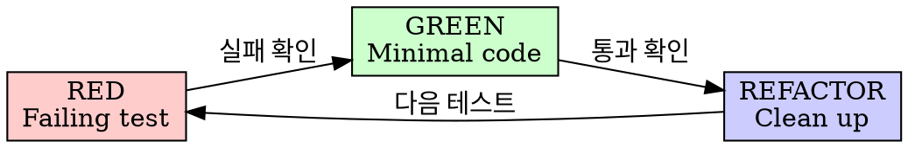

# Test-Driven Development (TDD)

## Overview

테스트를 먼저 작성합니다. 실패를 확인합니다. 최소 코드로 통과시킵니다.

**Why TDD?** 테스트를 먼저 작성하면 (1) 구현할 동작을 명확히 정의하고, (2) 실패를 확인해야 테스트가 올바른 것을 검증하는지 알 수 있으며, (3) 회귀 방지 안전망이 자동으로 구축됩니다.

## 핵심 원칙

**테스트 없이 프로덕션 코드를 작성하지 않는 이유:** 실패하는 테스트 없이 코드를 작성하면, 그 코드가 정말 필요한 동작을 구현하는지 검증할 방법이 없습니다. 테스트가 바로 통과하면 — 테스트가 실제로 동작을 검증하지 않는 것일 수 있습니다.

테스트 전에 코드를 작성했다면, 삭제하고 테스트부터 시작하세요.

## Red-Green-Refactor



### RED - Failing Test 작성

하나의 최소 테스트 작성.

```typescript
test('retries failed operations 3 times', async () => {
  let attempts = 0;
  const operation = () => {
    attempts++;
    if (attempts < 3) throw new Error('fail');
    return 'success';
  };
  const result = await retryOperation(operation);
  expect(result).toBe('success');
  expect(attempts).toBe(3);
});
```

### Verify RED - 실패 확인

**Why?** 실패를 확인하지 않으면 테스트가 실제로 원하는 동작을 검증하는지 알 수 없습니다.

```bash
npm test path/to/test.test.ts
```

확인:
- 테스트 실패 (에러가 아님)
- 실패 메시지가 예상대로
- 기능 누락으로 실패 (오타 아님)

### GREEN - Minimal Code

테스트를 통과시키는 가장 간단한 코드.

```typescript
async function retryOperation<T>(fn: () => Promise<T>): Promise<T> {
  for (let i = 0; i < 3; i++) {
    try {
      return await fn();
    } catch (e) {
      if (i === 2) throw e;
    }
  }
  throw new Error('unreachable');
}
```

### REFACTOR - Clean Up

GREEN 이후에만:
- 중복 제거
- 이름 개선
- 헬퍼 추출

테스트는 GREEN 유지. 동작 추가 금지.

## 주의 신호

이런 상황이면 TDD 사이클을 재점검하세요:

- **테스트 전에 코드 작성** → 테스트가 구현을 가이드하지 못함
- **테스트가 바로 통과** → 테스트가 실제 동작을 검증하지 않을 수 있음
- **"나중에 테스트 추가"** → 사후 테스트는 동작을 정의하지 못하고 구현을 확인할 뿐

이런 경우, 작성한 코드를 치우고 테스트부터 다시 시작하는 것이 장기적으로 더 빠릅니다.

## 진행 관리

Task 관리는 Claude가 상황에 맞게 선택:
- **Task tool** (subagent) - 복잡한 멀티스텝 작업
- **TodoWrite** - 간단한 체크리스트

## GitHub 연동

**커밋 메시지에 Epic 번호 포함:**

```bash
# 작업 중
git commit -m "feat: add retry operation

Refs #[epic-number]"

# 마지막 (PR 또는 최종 커밋)
git commit -m "feat: complete retry feature

Closes #[epic-number]"
```

## 관련 스킬

- **writing-plans**: TDD 전 상세 계획
- **systematic-debugging**: 버그 수정 시 TDD와 함께
- **verification**: 완료 전 검증
