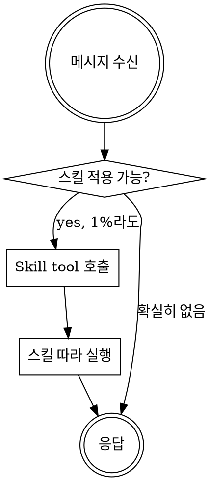
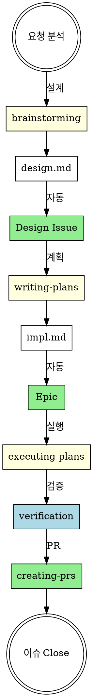

<EXTREMELY-IMPORTANT>
스킬이 적용될 가능성이 1%라도 있으면, 반드시 해당 스킬을 발동해야 합니다.

스킬이 적용되는 작업이면 선택의 여지가 없습니다. 반드시 사용해야 합니다.

협상 불가. 선택 불가. 합리화로 빠져나갈 수 없습니다.
</EXTREMELY-IMPORTANT>

# GitHub Superpowers 워크플로우

## 전제 조건

- `gh CLI` 인증 필수 (`gh auth status`)
- GitHub 저장소 연결 필요
- **처음 사용 시:** `/setup` 명령어로 Project, Labels 초기화 필요
- **마일스톤 관리:** `/milestone` 명령어로 마일스톤 생성/전환/종료

## 스킬 사용 규칙

**응답이나 행동 전에 관련 스킬을 먼저 호출하세요.** 1%라도 적용 가능성이 있으면 호출합니다.

## 전체 워크플로우

## 스킬 우선순위

1. **설계 스킬** (brainstorming) - 무엇을 만들지 정의
2. **계획 스킬** (writing-plans) - 상세 구현 계획 (Task 분해)
3. **추적 스킬** (creating-issues) - impl.md 기반 Epic 자동 생성
4. **실행 스킬** (executing-plans) - impl.md Task별 TDD 실행
5. **검증 스킬** (verification) - 완료 전 확인
6. **완료 스킬** (creating-prs, closing-issues) - PR 및 이슈 종료

## Red Flags

이런 생각이 들면 **멈추세요** - 합리화입니다:

| 생각 | 현실 |
|------|------|
| "간단한 질문이야" | 질문도 작업. 스킬 확인. |
| "먼저 컨텍스트 파악" | 스킬이 탐색 방법을 알려줌. 먼저 확인. |
| "계획 없이 바로 코드" | brainstorm → plan → 이슈 → 구현 순서. |
| "이슈는 나중에" | impl.md 완성 후 자동 생성됨. 순서 지켜. |
| "TDD는 과해" | 간단한 것도 복잡해짐. 사용. |
| "나중에 테스트" | 나중에 = 절대 안 함. 지금 TDD. |
| "검증은 알아서" | verification 스킬 사용. |

## 스킬 타입

**Rigid** (TDD, debugging): 정확히 따르세요. 유연하게 적용 금지.

**Flexible** (patterns): 원칙을 컨텍스트에 맞게 적용.

스킬 자체가 어떤 타입인지 알려줍니다.

## 관련 스킬

**초기 설정:**
- **setup**: Project, Labels 초기화 (처음 1회)
- **milestone**: 마일스톤 생성/전환/종료 (수시)

**설계 → 구현 계획:**
- **brainstorming**: 아이디어 → design.md → Design Issue (자동)
- **writing-plans**: design.md → impl.md (Task 분해)

**GitHub 추적:**
- **creating-issues**: impl.md → Epic (체크리스트로 Task 관리)
- **creating-prs**: PR 생성
- **closing-issues**: 이슈 종료

**구현:**
- **using-git-worktrees**: 격리된 작업 공간 생성
- **executing-plans**: impl.md Task별 TDD 실행 + Epic 체크리스트 업데이트
- **subagent-driven-development**: 서브에이전트 기반 개발 (같은 세션)
- **dispatching-parallel-agents**: 독립적 Task 병렬 실행
- **test-driven-development**: TDD 사이클
- **systematic-debugging**: 체계적 디버깅
- **verification**: 완료 전 검증

**코드 리뷰:**
- **requesting-code-review**: 코드 리뷰 요청
- **receiving-code-review**: 코드 리뷰 피드백 처리

**완료:**
- **finishing-a-development-branch**: 개발 브랜치 완료 (머지/PR/폐기)

**스택별 패턴 (참조용):**
- **nextjs-frontend**: FSD 아키텍처 + Zustand + React Query + shadcn/ui
- **nestjs-backend**: Hexagonal Architecture + UseCase 패턴 + BullMQ
- **fastapi-backend**: FastAPI + Celery + Async 패턴

**진행 관리:** Claude가 상황에 맞게 Task tool 또는 TodoWrite 선택
