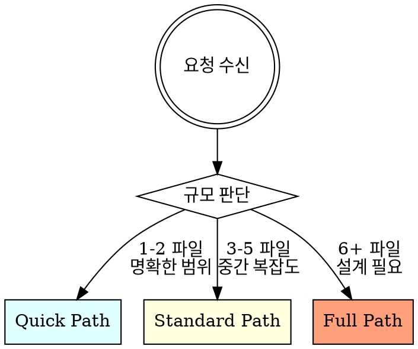
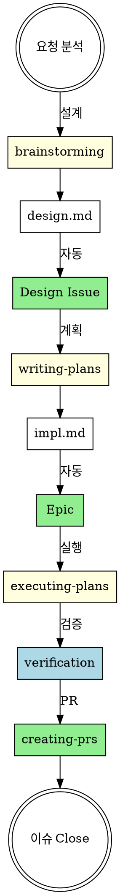

# GitHub Superpowers 워크플로우

## 전제 조건

- `gh CLI` 인증 필수 (`gh auth status`)
- GitHub 저장소 연결 필요
- **처음 사용 시:** `/init-github-superpowers` 명령어로 Project, Labels 초기화 필요
- **마일스톤 관리:** `/milestone` 명령어로 마일스톤 생성/전환/종료

## 작업 규모별 경로

작업 규모를 먼저 판단하고, 적절한 경로를 선택합니다.

| 경로 | 기준 | 스킬 체인 |
|------|------|-----------|
| **Quick** | 버그 수정, 작은 기능, 1-2 파일 변경 | TDD → verification → commit |
| **Standard** | 중간 기능, 3-5 파일, 기존 패턴 따름 | writing-plans → executing-plans → verification → PR |
| **Full** | 새 기능/아키텍처, 6+ 파일, 설계 판단 필요 | brainstorming → writing-plans → creating-issues → executing-plans → verification → PR |

## 스킬 사용 규칙

작업에 관련 스킬이 있으면 Skill tool로 호출합니다. 모델이 작업 내용을 보고 적절한 스킬을 자율 판단합니다.

## 전체 워크플로우

## 스킬 우선순위

1. **설계 스킬** (brainstorming) - 무엇을 만들지 정의
2. **계획 스킬** (writing-plans) - Plan Mode로 상세 구현 계획 (Task 분해)
3. **추적 스킬** (creating-issues) - impl.md 기반 Epic 자동 생성
4. **실행 스킬** (executing-plans) - impl.md Task별 TDD 실행
5. **검증 스킬** (verification) - 완료 전 확인
6. **완료 스킬** (creating-prs, closing-issues) - PR 및 이슈 종료

## 일반 가이드라인

- 규모가 큰 작업은 설계 → 계획 → 이슈 → 구현 순서를 따르면 효과적
- TDD는 작은 변경에서도 회귀 방지에 효과적 — 규모 판단 후 적용
- 검증은 주장 전에 — verification 스킬이 체계적 검증 지원
- 커밋/PR 전에는 테스트·빌드·린트 결과를 직접 확인

## 스킬 타입

**Rigid** (TDD, debugging): 핵심 원칙을 따릅니다. 이유는 각 스킬이 설명합니다.

**Flexible** (patterns): 원칙을 컨텍스트에 맞게 적용합니다.

## 관련 스킬

**초기 설정:**
- **init-github-superpowers**: Project, Labels 초기화 (처음 1회)
- **milestone**: 마일스톤 생성/전환/종료 (수시)

**설계 → 구현 계획:**
- **brainstorming**: 아이디어 → design.md → Design Issue (자동)
- **writing-plans**: design.md → Plan Mode → impl.md (Task 분해)

**GitHub 추적:**
- **creating-issues**: impl.md → Epic (체크리스트로 Task 관리)
- **creating-prs**: PR 생성
- **closing-issues**: 이슈 종료

**구현:**
- **using-git-worktrees**: 격리된 작업 공간 생성
- **executing-plans**: impl.md Task별 TDD 실행 + Epic 체크리스트 업데이트
- **subagent-driven-development**: 서브에이전트 기반 개발 (같은 세션)
- **dispatching-parallel-agents**: 독립적 Task 병렬 실행
- **test-driven-development**: TDD 사이클
- **systematic-debugging**: 체계적 디버깅
- **verification**: 완료 전 검증

**코드 리뷰:**
- **requesting-code-review**: 코드 리뷰 요청
- **receiving-code-review**: 코드 리뷰 피드백 처리

**완료:**
- **finishing-a-development-branch**: 개발 브랜치 완료 (머지/PR/폐기)

**스택별 패턴 (참조용):**
- **nextjs-frontend**: FSD 아키텍처 + Zustand + React Query + shadcn/ui
- **nestjs-backend**: Hexagonal Architecture + UseCase 패턴 + BullMQ
- **fastapi-backend**: FastAPI + Celery + Async 패턴

**진행 관리:** Claude가 상황에 맞게 Task tool 또는 TodoWrite 선택
