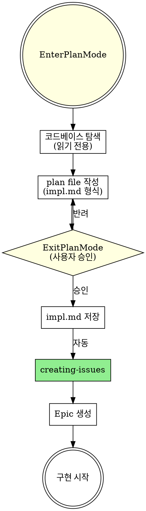
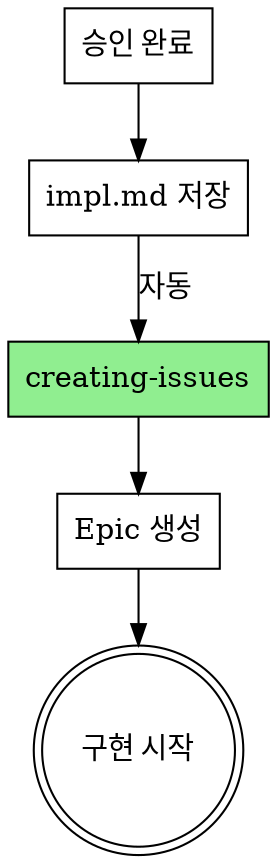

# Writing Plans (Plan Mode)

## Overview

구현 **가이드**를 작성합니다. 무엇을 어떤 순서로 할지 명확히 정의합니다.

**Plan Mode(EnterPlanMode)를 사용하여** 코드베이스를 안전하게 탐색한 후 구현 계획을 작성합니다.
계획 단계에서 Edit/Write가 물리적으로 차단되어 성급한 코드 수정을 방지합니다.

**impl.md ≠ 코드 생성기**
- 전체 구현 코드 작성 X
- 핵심 인터페이스/타입 시그니처만
- 접근법과 완료 기준에 집중

**Announce at start:** "writing-plans 스킬을 사용하여 Plan Mode로 구현 계획을 작성합니다."

**Save plans to:** `.claude/github-superpowers/plans/YYYY-MM-DD-<feature-name>-impl.md`

## The Process



## Step 1: Enter Plan Mode

**REQUIRED:** `EnterPlanMode`를 호출하여 Plan Mode에 진입합니다.

Plan Mode에서는:
- ✅ Glob, Grep, Read, WebFetch, WebSearch, AskUserQuestion 사용 가능
- ❌ Edit, Write, NotebookEdit **차단** (코드 수정 불가)
- ✅ plan file에 계획 작성 가능

**plan file vs impl.md:**
- plan file(`~/.claude/plans/`)은 **임시 리뷰용** — 승인 과정에서 사용
- impl.md(`.claude/github-superpowers/plans/`)는 **영구 산출물** — 승인 후 Write tool로 저장
- settings.json 변경 불필요 (impl.md 경로는 기능별로 동적이므로 고정 불가)

## Step 1.5: Serena 메모리 로드 (Optional)

Plan Mode 진입 후, 코드베이스 탐색 전에 Serena 메모리를 로드합니다.
이전 세션에서 축적된 구조/패턴 지식을 활용하면 탐색 범위를 크게 줄일 수 있습니다.

```
# 1. Serena 프로젝트 활성화 (등록된 프로젝트명 또는 경로)
activate_project("<project-name>")

# 2. 사용 가능한 메모리 확인
list_memories

# 3. 구현 계획에 관련된 메모리 선택 로드 (우선순위순)
read_memory("codebase_structure")            # 디렉토리 구조, 모듈 배치
read_memory("architecture_and_conventions")  # 아키텍처 패턴, DI 패턴, 네이밍
read_memory("style_and_patterns")            # 코드 스타일, UseCase/Port/Adapter 패턴
```

**activate_project 실패 시** (프로젝트 미등록): Serena 메모리를 건너뛰고 Step 2로 진행.

**메모리가 충분한 경우:** Step 2에서 이미 아는 구조는 건너뛰고, 변경 대상 파일/심볼만 집중 탐색.
**메모리가 없거나 Serena 미사용:** 이 단계를 건너뛰고 Step 2로 진행합니다.

## Step 2: Explore Codebase (Read-Only)

Plan Mode 안에서 코드베이스를 탐색합니다:
- 프로젝트 구조 파악 (Glob, Read)
- 기존 패턴/컨벤션 확인 (Grep)
- 관련 문서 검토 (design.md, CLAUDE.md 등)
- 의존성/인터페이스 확인

**목표:** 구현에 필요한 정보를 충분히 수집 (Step 1.5의 메모리로 이미 파악된 부분은 생략)

## Step 3: Write Plan (impl.md format)

plan file에 아래 형식으로 구현 계획을 작성합니다.

### Plan Document Header

```markdown
# [Feature Name] Implementation Plan

> **For Claude:** REQUIRED SUB-SKILL: Use executing-plans to implement this plan task-by-task.

**Goal:** [한 문장으로 무엇을 만드는지]

**Architecture:** [2-3 문장으로 접근법]

**Tech Stack:** [핵심 기술/라이브러리]

**GitHub Issue:** #[issue-number] (Epic - 승인 후 생성)

---
```

### Task Structure

**CRITICAL: impl.md는 구현 가이드이지, 구현 코드가 아닙니다.**
**CRITICAL: 하지만 에이전트가 impl.md만으로 구현할 수 있을 만큼 충분한 스펙을 포함해야 합니다.**

````markdown
### Task N: [Component Name]

**목표:** [이 Task가 달성하는 것 - 1문장]

**Design Reference:** design.md §[관련 섹션명]

**Files:**
- Create: `exact/path/to/file.py`
- Modify: `exact/path/to/existing.py` (함수명 또는 라인 범위)
- Test: `tests/exact/path/to/test.py`

**구현 스펙:** (design.md에서 이 Task에 필요한 핵심 스펙을 인라인)
- Backend: API 응답 DTO 전체 필드, 비즈니스 로직 규칙, 엣지 케이스
- Frontend: 레이아웃 구조, 컴포넌트 동작, 상태 UX, 스타일링 규칙

**접근법:**
1. [무엇을 먼저 하고]
2. [그 다음 무엇을 하고]
3. [최종적으로 무엇을 확인]

**핵심 인터페이스:**
```python
class SomeClass:
    def method(self, arg: Type) -> ReturnType:
        """한 줄 설명."""
        ...
```

**테스트 케이스:**
- `test_happy_path`: 정상 동작 확인
- `test_error_case`: 에러 처리 확인

**수용 기준:** (design.md Acceptance Criteria에서 이 Task 해당 항목)
- [ ] AC-XX-X: [시나리오와 확인 항목]

**완료 기준:**
- [ ] 테스트 통과
- [ ] 린터 통과
````

### Design-Aware Task 원칙

**에이전트는 impl.md만 읽고 구현한다.** 따라서:

1. **Backend Task 필수 포함:**
   - API 응답 DTO 인터페이스 (시그니처가 아닌 전체 필드 정의)
   - 비즈니스 로직 규칙 (계산식, 분모/분자, 정렬 기준)
   - 엣지 케이스 (0분모, null, 빈 데이터)

2. **Frontend Task 필수 포함:**
   - 레이아웃 구조 (와이어프레임 텍스트 설명 또는 인라인)
   - 컴포넌트별 동작 (클릭, 필터, 폴링, 상태 전환)
   - 반응형 규칙 (breakpoint별 변화)
   - 상태 UX (loading/empty/error 처리)
   - 스타일링 상세 (색상, 강조, 조건부 표시)

3. **공통:**
   - design.md Acceptance Criteria를 Task별로 분배
   - `Design Reference`로 원본 섹션 추적 가능하게

### Bite-Sized Task Granularity

**각 스텝은 하나의 액션 (2-5분):**
- "failing test 작성" - 스텝
- "실행하여 실패 확인" - 스텝
- "최소 코드로 테스트 통과" - 스텝
- "테스트 실행 및 통과 확인" - 스텝
- "커밋" - 스텝

### Code Snippet Rules

- **인터페이스/DTO**: 전체 필드 정의 포함 (에이전트가 정확한 응답 구조를 알아야 함)
- **구현 로직**: 시그니처 + docstring 수준만 (구현부는 `...` 또는 `pass`)
- 전체 구현 코드 작성 금지 - `executing-plans`에서 작성
- 복잡한 알고리즘이면 의사코드로 설명

## Step 3.5: Plan Stress Test (Self-Check)

**ExitPlanMode 전에 각 Task를 검증합니다:**

각 Task에 대해 스스로 질문:
1. **구현 충분성:** "이 Task의 정보만으로 에이전트가 design.md 없이 구현할 수 있는가?"
2. **스펙 완전성:** Backend — DTO 전체 필드, 비즈니스 규칙, 엣지 케이스 포함? Frontend — 레이아웃, 상태 UX, 스타일링 규칙 포함?
3. **수용 기준:** design.md의 Acceptance Criteria가 Task별로 분배되어 있는가?
4. **테스트 가능성:** 완료 기준이 자동화된 테스트로 검증 가능한가?

**하나라도 "아니오"면** 해당 Task를 보강한 후 ExitPlanMode.

## Step 4: Exit Plan Mode (Approval)

**REQUIRED:** 계획 작성이 완료되면 `ExitPlanMode`를 호출합니다.

- 사용자가 plan file(impl.md 내용)을 리뷰
- **승인:** 다음 단계로 진행
- **반려:** 피드백 반영 후 plan file 수정 → 다시 ExitPlanMode

## After Approval

**ExitPlanMode 승인 후 자동으로 실행:**

**1. impl.md 저장:**
- plan file 내용을 `.claude/github-superpowers/plans/YYYY-MM-DD-<feature-name>-impl.md`에 저장
- Write tool 사용 (Plan Mode 해제 후 사용 가능)

**2. GitHub Epic 생성:**
- **REQUIRED:** Use creating-issues 스킬
- Epic 이슈 생성 (Task를 체크리스트로 포함)
- 프로젝트/마일스톤 연결
- impl.md에 Epic 번호 업데이트



**3. 다음 단계 (AskUserQuestion):**

```
AskUserQuestion:
"구현 계획이 승인되었습니다.
- 저장: .claude/github-superpowers/plans/YYYY-MM-DD-<feature>-impl.md
- GitHub Epic: #M (N개 Task)

다음 단계는?"

옵션:
1. 이어서 구현 (Recommended)
   - executing-plans 스킬로 실행 방식 선택
   - Agent Teams (자동) 또는 수동 구현 중 선택
2. 오늘은 여기까지
```

**"이어서 구현" 선택 시:**
- **REQUIRED:** Use executing-plans 스킬
- Step 0에서 실행 방식 선택:
  - Agent Teams: subagent-driven-development (빠름, 현재 브랜치)
  - 수동 구현: worktree + TDD (느림, 격리된 브랜치)

## Remember

- **EnterPlanMode 필수** - 계획 단계에서 코드 수정 방지
- 정확한 파일 경로
- **구현 가이드** (전체 코드 X) - 코드는 `executing-plans`에서
- **Design-Aware**: 에이전트가 impl.md만으로 구현 가능해야 함 — 필수 스펙 인라인
- DTO/인터페이스는 전체 필드 포함, 구현 로직은 시그니처만
- Task당 목표 1개, 명확한 완료 기준 + 수용 기준(AC)
- **줄 수보다 충실도**: "에이전트가 design.md 없이 이 Task를 구현할 수 있는가?"가 기준
- 규모가 큰 설계는 MVP 단위로 impl.md를 분할하여 각각 별도 Epic으로 관리

## 관련 스킬

- **brainstorming**: 계획 전 설계
- **creating-issues**: Epic 생성
- **executing-plans**: 구현 실행 (다음 단계)
- **subagent-driven-development**: Agent Teams 자동 실행
- **test-driven-development**: TDD 구현
