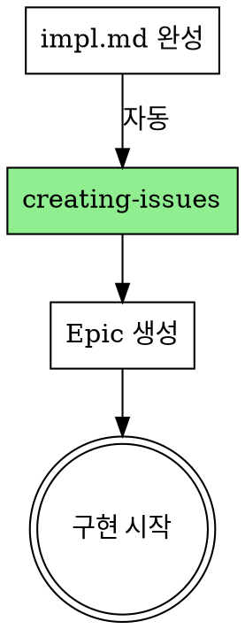

# Writing Plans

## Overview

엔지니어가 코드베이스에 대한 컨텍스트가 없다고 가정하고 상세한 구현 계획을 작성합니다.

**Announce at start:** "writing-plans 스킬을 사용하여 구현 계획을 작성합니다."

**Save plans to:** `docs/plans/YYYY-MM-DD-<feature-name>-impl.md`

## Bite-Sized Task Granularity

**각 스텝은 하나의 액션 (2-5분):**
- "failing test 작성" - 스텝
- "실행하여 실패 확인" - 스텝
- "최소 코드로 테스트 통과" - 스텝
- "테스트 실행 및 통과 확인" - 스텝
- "커밋" - 스텝

## Plan Document Header

```markdown
# [Feature Name] Implementation Plan

> **For Claude:** REQUIRED SUB-SKILL: Use executing-plans to implement this plan task-by-task.

**Goal:** [한 문장으로 무엇을 만드는지]

**Architecture:** [2-3 문장으로 접근법]

**Tech Stack:** [핵심 기술/라이브러리]

**GitHub Issue:** #[issue-number] (Epic)

---
```

## Task Structure

```markdown
### Task N: [Component Name]

**Files:**
- Create: `exact/path/to/file.py`
- Modify: `exact/path/to/existing.py:123-145`
- Test: `tests/exact/path/to/test.py`

**Step 1: Write the failing test**
[코드]

**Step 2: Run test to verify it fails**
Run: `pytest tests/path/test.py::test_name -v`
Expected: FAIL

**Step 3: Write minimal implementation**
[코드]

**Step 4: Run test to verify it passes**
Run: `pytest tests/path/test.py::test_name -v`
Expected: PASS

**Step 5: Commit**
```bash
git add tests/path/test.py src/path/file.py
git commit -m "feat: add specific feature

Refs #[epic-number]"
```
```

## After the Plan

**impl.md 완성 후 자동으로 GitHub 연동:**

1. **REQUIRED:** Use creating-issues 스킬
2. Epic 이슈 생성 (Task를 체크리스트로 포함)
3. 프로젝트/마일스톤 연결
4. impl.md에 Epic 번호 업데이트



**구현 시작 시:**
- **REQUIRED:** Use test-driven-development 스킬
- 각 Task별로 TDD 사이클 진행
- 커밋 메시지에 `Refs #[epic-number]` 포함
- 마지막 커밋/PR에서 `Closes #[epic-number]`

## Remember

- 정확한 파일 경로
- 완전한 코드 (추상적인 설명 X)
- 정확한 명령어와 예상 출력
- DRY, YAGNI, TDD, 빈번한 커밋

## 관련 스킬

- **brainstorming**: 계획 전 설계
- **creating-issues**: Epic 생성
- **test-driven-development**: TDD 구현
